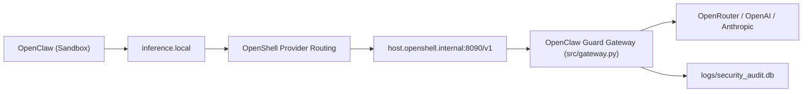

# OpenClaw Guard

OpenClaw Guard 是一个运行在 WSL-Ubuntu 主机上的安全网关项目，用于把 OpenClaw 的模型请求统一接入主机侧审查网关，再转发到 OpenRouter / OpenAI / Anthropic。

核心目标：
- 所有模型请求走统一入口，便于审计与控制。
- 在转发前做输入/输出安全检查（如危险命令拦截）。
- 保持与 OpenShell/NemoClaw 的 `inference.local` 路由兼容。

## 架构概览

当前有效链路：

`OpenClaw (sandbox)` -> `inference.local` -> `OpenShell provider` -> `host.openshell.internal:8090` -> `src/gateway.py` -> `Upstream LLM`



说明：
- `inference.local` 是 OpenShell 的沙箱内统一入口。
- 真正转发到 `8090` 由 OpenShell provider 的 `OPENAI_BASE_URL` 决定。

## 目录说明

- `src/gateway.py`: 主机侧安全网关（FastAPI）
- `src/onboard.py`: 生成 onboarding 产物（policy / openclaw 配置）
- `src/cli.py`: 项目 CLI（onboard/providers/stop）
- `wsl_start.sh`: WSL 一键启动脚本
- `nemoclaw-blueprint/`: Blueprint 相关文件（目标态）
- `tests/test_gateway.py`: 网关单元测试

## 环境要求

- Windows 11 + WSL2 Ubuntu
- Python 3.11+（建议 3.12）
- OpenShell / NemoClaw 已安装并可在 WSL 中运行
- 已准备 `.venv` 和依赖（`requirements.txt`）

## 安装与启动（WSL）

1. 进入项目目录

```bash
cd /mnt/d/ag-projects/guard
```

2. 准备环境（如尚未准备）

```bash
python3 -m venv .venv
./.venv/bin/pip install -r src/requirements.txt
```

3. 配置密钥（`.env`）

至少设置一个上游 key（示例）：

```env
OPENROUTER_API_KEY=...
```

4. 启动网关

```bash
set -a; source .env; set +a
./.venv/bin/python src/gateway.py
```

5. 配置 OpenShell inference 指向网关

```bash
openshell provider delete guard-gateway 2>/dev/null || true
openshell provider create \
  --name guard-gateway \
  --type openai \
  --credential OPENAI_API_KEY=guard-managed \
  --config OPENAI_BASE_URL=http://host.openshell.internal:8090/v1

openshell inference set --provider guard-gateway --model openrouter/stepfun/step-3.5-flash:free --no-verify
openshell inference get
```

6. 启动/接入 NemoClaw

```bash
./wsl_start.sh
# 或手动:
nemoclaw onboard
```

## 测试

```bash
./.venv/bin/python -m unittest -v tests/test_gateway.py
```

## 常见问题

- `402 Payment Required`  
  说明上游模型额度/计费不足，优先切换到可用免费模型（例如 `openrouter/stepfun/step-3.5-flash:free`）。

- `429 Too Many Requests`  
  说明上游限流。网关已支持自动重试（默认重试 2 次，可用 `GATEWAY_429_RETRIES` 调整）。

- Chat 无输出但网关返回 200  
  先看 `logs/gateway_runtime.log`，确认是否上游 402/429 或模型选择问题。

## Blueprint 说明

本项目包含 `nemoclaw-blueprint/` 作为目标态配置。  
若要让项目内 blueprint 成为运行时真源，需要在 onboarding 前显式同步到 NemoClaw 实际使用目录。
