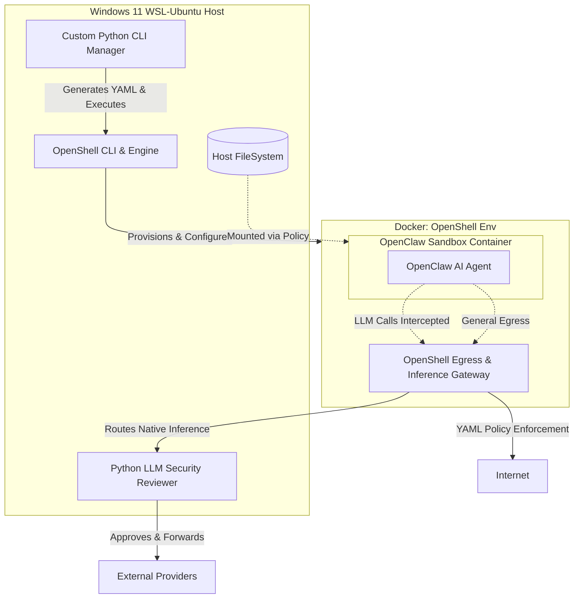
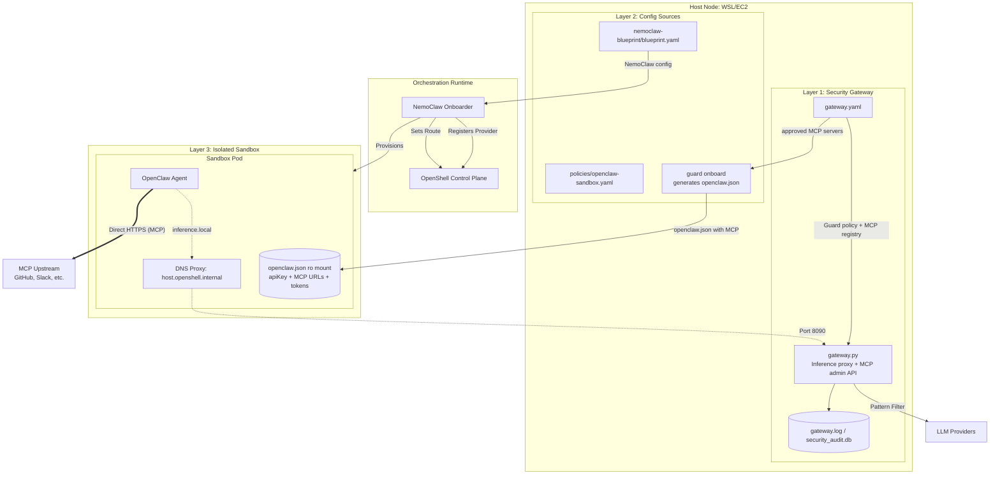
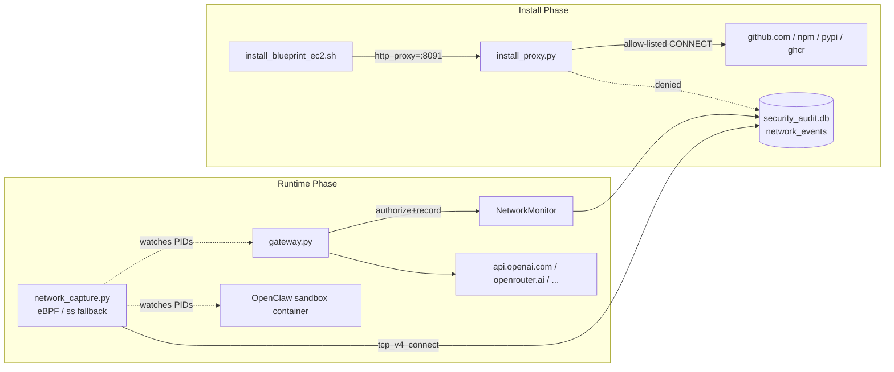
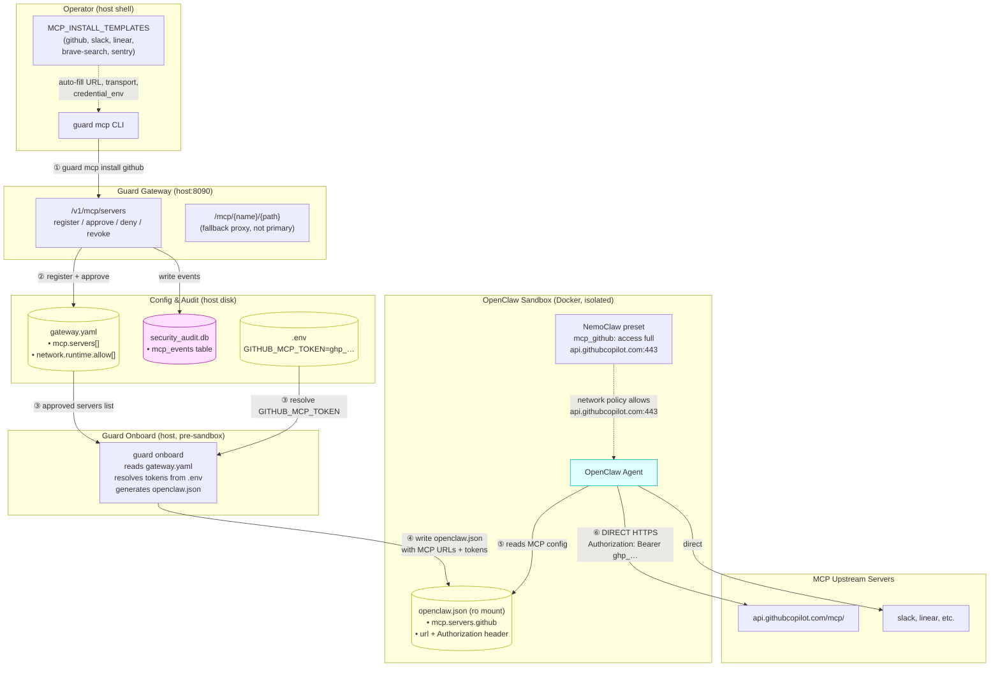

# OpenClaw SECURE Guard: Comprehensive Implementation Plan

This document outlines the strategic deployment of the OpenClaw AI agent within a security-hardened environment powered by **NVIDIA OpenShell** and **NemoClaw**. It tracks the evolution from the initial custom CLI design to the modern, 100% Blueprint-driven architecture, and now the Guard-owned config split plus MCP governance layer.

---

## 1. Initial System Architecture (V1-V2)
*This section reflects the original architecture, leveraging a custom Python CLI to drive OpenShell directly.*



---

## 2. Requirement Breakdown & Evolution

### Requirement 1: Directory & External Access Management
*   **Evolution**: Switched to **Zero-Injection**. All mounts are declared in the NemoClaw Blueprint. Host directories are mounted as **Read-Only** volumes by the orchestrator before the sandbox starts.

### Requirement 2: Network & AI Model Connection Management
*   **Evolution**: Inference routing is now a first-class citizen in the **NemoClaw Layer 2 Blueprint**. `inference.local` is enforced by OpenShell kernel rules (Layer 3) to prevent any network bypass.

### Requirement 3: LLM Forwarding & Security Review
*   **Evolution**: The `gateway.py` (Layer 1) remains the security arbiter. It handles pattern matching (e.g., blocking `rm -rf`) and upstream provider failover (e.g., 429 retries).

### Requirement 4: Using NVIDIA OpenShell
*   **Successfully Adopted.** OpenShell orchestrates the Docker containers and kernel-level Landlock/Egress policies.

---

## 3. Current Effective Architecture (v8): Blueprint-Driven + MCP Direct Access
*As of April 2026. Inference is proxied through the Guard Gateway; MCP traffic goes direct from sandbox.*



### Key Breakthroughs (v5-v8):
1.  **Validation Loop Resolution**: By mapping `host.openshell.internal` to `127.0.0.1` on the host side, the `nemoclaw onboard` process can validate the custom security gateway during installation.
2.  **Mock Success Logic**: `gateway.py` now detects NemoClaw onboarding probes and returns mock success, enabling non-interactive installation without real upstream LLM calls.
3.  **Persistent Source Pattern**: Scripts bypass the official `nemoclaw.sh` bootstrap (which has a `trap rm -rf` bug that breaks npm symlinks) and instead download the NemoClaw source tarball to a persistent directory `~/.nemoclaw/source/`, then run `scripts/install.sh` directly. `NEMOCLAW_REPO_ROOT` is exported to force `is_source_checkout()` -> Path A (from source), preventing `install.sh` from re-cloning and overwriting our customizations.
4.  **Immediate Docker Access**: A mandatory `sudo chmod 666 /var/run/docker.sock` bypasses the "session restart lag" common in cloud VM (EC2) deployments.
5.  **Environment Persistence**: Installer automatically updates `~/.bashrc` with required `PATH` and `nvm` exports for permanent command availability.
6.  **One-Click Installers**: `install_blueprint_wsl.sh` and `install_blueprint_ec2.sh` automate the entire stack.
7.  **Interactive Model Setup (`wizard.py`)**: Before gateway/NemoClaw start, a setup wizard reads `.env`, tests real API connectivity for each configured provider, and lets the user choose a default model. The choice is written into both `blueprint.yaml` and `.env` (`MODEL_ID`), ensuring the full stack (gateway -> NemoClaw -> sandbox) uses the user's preferred model from the first boot. TTY auto-detection (`sys.stdin.isatty()`) enables non-interactive mode when no terminal is attached (CI/SSH without `-t`).
8.  **Blueprint Pre-merge**: Custom blueprint is synced into the NemoClaw source tree *before* `install.sh` runs, so the first onboard uses our config directly. This eliminates the need for a second onboard pass, saving ~3-5 minutes. All official policy files (not just presets) are preserved before `rsync --delete`.
9.  **Gateway Systemd Service**: `guard-gateway.service` provides auto-start on EC2 reboot and crash recovery (RestartSec=3), replacing the `nohup` approach which doesn't survive reboots.
10. **OpenClaw Version Override**: `OPENCLAW_VERSION` env var triggers a local build of `Dockerfile.base` (tagged as `ghcr.io/nvidia/nemoclaw/sandbox-base:latest`), so the sandbox `FROM` uses the locally-built base with the desired version. This avoids the +1.7GB image bloat from injecting `npm install` into the sandbox Dockerfile (which would create a second copy of openclaw in Docker's overlay FS).

---

## 4b. Model Setup Wizard (`guard/wizard.py`)

The setup wizard bridges the gap between `.env` key configuration and the runtime model selection that was previously hardcoded.

### Problem
Previously, `NEMOCLAW_MODEL` was hardcoded to `nvidia/nemotron-3-super-120b-a12b:free` in install scripts. Users who configured `OPENAI_API_KEY` or `ANTHROPIC_API_KEY` still got the OpenRouter free model by default, with no way to choose during installation.

### Solution Architecture
```
.env (API keys) -> wizard.py -> Tests connectivity per provider
                              |
                              +-> Presents numbered model menu
                              |   (only reachable providers shown)
                              |
                              +-> Writes MODEL_ID to .env
                              +-> Patches blueprint.yaml
                                 (inference.profiles.default.model)
```

### Execution Flow in `install_blueprint_ec2.sh` (legacy)

> **Note**: For MCP-enabled deployments, use `ec2_ubuntu_start.sh` instead (see Section 9.2).

```
Step 0:  System dependencies (apt-get)
Step 1:  Python venv + pip install
Step 1b: wizard.py (reads .env, tests APIs, user picks model; TTY auto-detect)
Step 2:  Start gateway.py (with MODEL_ID from wizard.py)
Step 3:  Download NemoClaw source tarball (persistent ~/.nemoclaw/source/)
Step 3b: Pre-merge Guard Blueprint into source tree (all policies/*, not just presets)
Step 3c: (Optional) If OPENCLAW_VERSION set: build Dockerfile.base locally
Step 3d: Run official scripts/install.sh (NEMOCLAW_REPO_ROOT -> Path A from source)
Step 4a: Persist PATH to ~/.bashrc
Step 4b: Configure systemd guard-gateway.service (auto-start on reboot)
```

### Key Design Decisions
- **Runs before gateway**: `wizard.py` tests upstream providers directly (not via the local gateway) so it works on a fresh install.
- **Writes both `.env` and `blueprint.yaml`**: `.env` is consumed by `gateway.py` and start scripts; `blueprint.yaml` is consumed by NemoClaw onboard.
- **TTY auto-detect**: `sys.stdin.isatty()` auto-switches to non-interactive when no terminal is attached (CI/SSH without `-t`). Override with `--interactive` or `--non-interactive` flags.
- **No new dependencies**: Uses `httpx` and `pyyaml` already in project dependencies.

---

## 5. Blueprint Loading Mechanism: The "Global Sync" Strategy

To ensure NemoClaw consumes the project-specific blueprint without requiring complex CLI path injections, the system employs a **Global Source Synchronization** mechanism.

### The Mechanism
NemoClaw's onboarding engine uses a prioritized search path for blueprints. The primary authoritative location is the user's global configuration directory: `~/.nemoclaw/source/nemoclaw-blueprint/`.

### Implementation Steps (v2: Pre-merge)
1.  **Source Download**: The installer downloads the NemoClaw source tarball to `~/.nemoclaw/source/` (bypassing the official `nemoclaw.sh` bootstrap which has a temp-dir cleanup bug).
2.  **Pre-merge**: Before running `install.sh`, the installer copies official policy presets into our project directory, then uses `rsync -a --delete` to overwrite the source tree's `nemoclaw-blueprint/` with our custom version.
3.  **Single Onboard**: `install.sh` runs its built-in onboard step, which automatically uses the pre-merged blueprint. No second onboard is needed.
4.  **Cross-Layer Binding**: The blueprint defines relative mappings (e.g., `sandbox_workspace/openclaw`), and NemoClaw binds host-side configuration (Layer 2) to the sandbox runtime (Layer 3).

This strategy guarantees that the **Source of Truth** always resides within the version-controlled repository while remaining perfectly compatible with NemoClaw's standardized deployment lifecycle.

---

## 5b. OpenClaw Version Override Strategy

### Problem
The GHCR base image (`ghcr.io/nvidia/nemoclaw/sandbox-base:latest`) pins a specific OpenClaw version (e.g., `2026.3.11`). Users may need a newer or different version without waiting for the GHCR image to be updated.

### Failed Approaches
1. **`sed` on `Dockerfile.base` only**: The sandbox `Dockerfile` uses `FROM ghcr.io/...sandbox-base:latest` - it pulls the pre-built GHCR image, ignoring local `Dockerfile.base` modifications.
2. **Inject `RUN npm install -g openclaw@X` into sandbox `Dockerfile`**: Creates a new Docker layer with the second copy of openclaw. Due to Docker's overlay filesystem, the old version in the base layer cannot be removed, resulting in **+1.7GB image bloat** (4.1GB vs 2.4GB). The OpenShell gateway's image upload times out on constrained instances.
3. **Merge `npm install` into existing `RUN` layer**: Same 4.1GB result - npm downloads to cache + installs new openclaw, while old version persists in base layer below.

### Working Solution: Local Base Image Build
```
.env (OPENCLAW_VERSION=2026.4.2)
    |
    v
sed on Dockerfile.base: openclaw@2026.3.11 -> openclaw@2026.4.2
    |
    v
docker build -f Dockerfile.base -t ghcr.io/nvidia/nemoclaw/sandbox-base:latest .
    |
    v
nemoclaw onboard -> sandbox Dockerfile FROM ${BASE_IMAGE} -> uses local image
    |
    v
Sandbox has openclaw@2026.4.2 (image size: ~2.2GB, same as default)
```

The local build tags the image with the same name as the GHCR image, so Docker's `FROM` directive uses the local version instead of pulling from GHCR. The resulting image is actually slightly smaller (~2.2GB vs ~2.4GB) because it only contains one version of openclaw.

---

## 5c. Gateway Persistence (systemd)

### Problem
The gateway was started via `nohup`, which doesn't survive EC2 reboots. Manual intervention was required after every reboot.

### Solution
The installer creates a systemd service `guard-gateway.service`:
- **Auto-start on boot** (`WantedBy=multi-user.target`)
- **Crash recovery** (`Restart=always`, `RestartSec=3`)
- **Environment from `.env`** (`EnvironmentFile=$PROJECT_DIR/.env`)
- **Replaces nohup**: The installer kills the `nohup` gateway before enabling systemd

The `nohup` launch in Step 2 is still needed for the installation process itself (NemoClaw onboard requires a running gateway), but systemd takes over in Step 4b.

---

## 6. Operational Workflow

### Installation (Zero-to-Hero)

**AWS EC2 (recommended for full MCP support):**
```bash
bash ec2_ubuntu_start.sh    # 9-step automated deployment with MCP
```

**Legacy / WSL installers (without MCP onboard flow):**
```bash
./install_blueprint_wsl.sh  # For Windows WSL
./install_blueprint_ec2.sh  # For AWS EC2 (legacy, no MCP registration)
```

### Runtime Path — Inference
1.  **Request**: OpenClaw in sandbox sends model requests to `https://inference.local/v1`.
2.  **Interception**: OpenShell Egress Policy redirects this to `http://host.openshell.internal:8090/v1`.
3.  **Audit**: `gateway.py` on the host intercepts the request, checks for dangerous commands (like `rm -rf /`), and logs the audit.
4.  **Forward**: If safe, the gateway forwards the request to the real provider (OpenRouter/OpenAI/Anthropic) using API keys from the host's `.env`.

### Runtime Path — MCP (direct access)
1.  **Config**: `openclaw.json` (ro mount) contains MCP server URLs and pre-injected auth tokens.
2.  **Connect**: OpenClaw reads config and connects directly to the MCP upstream (e.g., `api.githubcopilot.com:443`).
3.  **Network**: NemoClaw preset allows the specific MCP host through the sandbox egress policy.
4.  **No gateway hop**: MCP traffic does NOT go through Guard Gateway. Only inference traffic is proxied.

### Maintenance
*   **Security Rules**: Modify `guard/gateway.py` to add new blocking patterns.
*   **Network Policies**: Update `gateway.yaml` `network.{install,runtime}` sections, then `POST /v1/network/policy/reload` to hot-reload without restart.
*   **MCP Servers**: Use `guard mcp install <name>` to register, then re-run `guard onboard` to regenerate `openclaw.json` with the new MCP stanzas. Apply NemoClaw preset for network access.
*   **Artifact Sync**: Use the Guard CLI/onboard flow to regenerate sandbox configurations when blueprint structure changes.

---

## 7. Network Authorization & Real-time Detection (V6)

Adds an explicit network layer that complements the existing pattern matching, plugging two long-standing gaps:

1.  **Install-time blind spot** - `install_blueprint_*.sh` previously trusted any host that `curl`/`pip`/`npm` reached during Step 3.
2.  **Runtime invisibility** - `gateway.py` only audited *which provider/model* a request hit, never *which TCP endpoint* the host actually connected to, nor whether sandbox processes were performing out-of-band egress.

### 7.1 Architecture



### 7.2 Components

| Component | Layer | Backend | Default |
|---|---|---|---|
| `network_monitor.py` | Library | sqlite3 | n/a |
| `install_proxy.py` | Install proxy on `127.0.0.1:8091` | stdlib socket + select | `default: deny` |
| `gateway.py` upstream hooks | Application | httpx interception | `default: warn` |
| `network_capture.py` | Kernel daemon | bcc eBPF, ss fallback | `default: warn` |

### 7.3 Decision Model

`NetworkMonitor.authorize(host, port, scope)` returns one of:
- `allow` - entry matched, `enforcement=enforce`
- `warn` - recorded with non-fatal reason
- `monitor` - recorded silently
- `block` - `default=deny` + no entry, or rate limit exceeded

Per-entry `rate_limit: { rpm: N }` uses a 60-second sliding window keyed on `host`. Hot-reload via `POST /v1/network/policy/reload` clears the rate buckets.

### 7.4 systemd

Two units, `EnvironmentFile` of `.env`:
- `guard-gateway.service` - runs as the install user, app-layer monitor + LLM router
- `guard-network-capture.service` - runs as `root` (eBPF requires `CAP_BPF`/`CAP_SYS_ADMIN`), eBPF or `ss` fallback

### 7.5 Deliberate Non-goals

- TLS termination (no MitM, no CA injection - splice-only)
- DNS sinkhole (handled separately if needed)
- Egress quotas / billing
- Webhook alert delivery (the audit table is the integration point)

---

## 8. Guard-owned Config Split + MCP Governance (V7)

This is the current architectural step introduced by the plan in `C:\Users\bfore\.claude\plans\glistening-toasting-gizmo.md` and now implemented in the repository.

### 8.1 Why the refactor was needed

Two layering issues existed in the previous design:

1. `nemoclaw-blueprint/blueprint.yaml` was being used as a dumping ground for Guard-owned `network.*` data that NemoClaw does not consume.
2. Guard CLI network mutations were directly editing YAML on disk even though the system is increasingly centered around HTTP-administered gateway behavior.

To fix that cleanly, Guard-owned policy moved into a separate config file and MCP governance was built on top of that boundary.

### 8.2 New ownership model

- `nemoclaw-blueprint/blueprint.yaml`
  - NemoClaw-owned fields only: sandbox, inference profiles, policy, mappings.
- `gateway.yaml`
  - Guard-owned fields: `network.install`, `network.runtime`, and `mcp.servers`.

Example shape:

```yaml
version: 1

network:
  install:
    default: deny
    allow:
      - host: github.com
        ports: [443]
        purpose: NemoClaw source tarball
  runtime:
    default: warn
    allow:
      - host: openrouter.ai
        ports: [443]
        purpose: OpenRouter upstream

mcp:
  servers:
    - name: filesystem
      url: https://mcp.example.com/sse
      transport: sse
      credential_env: MCP_FS_TOKEN
      status: pending
      registered_at: 2026-04-08T14:00:00Z
      approved_at: null
      approved_by: null
      purpose: Filesystem MCP for repo browsing
```

### 8.3 Code changes delivered

- New file `gateway.yaml` at the project root.
- New module `guard/gateway_config.py` for Guard-owned YAML I/O and MCP server operations.
- `guard/blueprint_io.py` reduced to NemoClaw-relevant helpers such as `set_default_model`.
- `guard/network_monitor.py`, `guard/network_capture.py`, `guard/onboard.py`, and `guard/wizard.py` now read/write Guard policy from `gateway.yaml`.
- New migration script `tools/migrate_blueprint_to_gateway.py` to move `network:` out of `nemoclaw-blueprint/blueprint.yaml`.

### 8.4 MCP Architecture

> **Architecture evolution**: V7 originally designed MCP as a gateway-proxied model (sandbox → Guard `/mcp/{name}/` → upstream). After EC2 end-to-end testing in V8, the project adopted **direct MCP access** from the sandbox instead. The proxy endpoint still exists in code as a fallback but is not the primary runtime path. See Section 9.4 for the current architecture and rationale.

#### 8.4.1 Current MCP architecture (V8: direct access)



#### 8.4.2 Data flow step-by-step (current)

| Step | Actor | Action | Target |
|------|-------|--------|--------|
| ① | Operator | `guard mcp install github --by alice` | Gateway Admin API |
| ② | Gateway | `register` + `approve` → write to `gateway.yaml` | `mcp.servers[]` |
| ③ | Guard onboard | Read approved servers from `gateway.yaml`, resolve `credential_env` from `.env` | Config resolution |
| ④ | Guard onboard | Write `openclaw.json` with `mcp.servers.github = {url, headers: {Authorization}}` | `sandbox_workspace/openclaw/openclaw.json` |
| ⑤ | Sandbox OpenClaw | Read MCP config from `openclaw.json` (ro mount) | Local config |
| ⑥ | Sandbox OpenClaw | Connect DIRECTLY to `api.githubcopilot.com:443` with token from config | MCP upstream |

#### 8.4.3 Security boundaries (current)

```
┌─────────────────────────────────────────────────────┐
│ Sandbox (Layer 3)                                   │
│  • MCP tokens in openclaw.json (ro mount, not       │
│    writable by sandbox processes)                    │
│  • Network egress controlled by NemoClaw presets     │
│    (only allowlisted MCP hosts reachable)            │
│  • Inference traffic still goes through Guard        │
│    Gateway (inference.local → host:8090)             │
└──────────────┬──────────────────────────────────────┘
               │ HTTPS + Authorization: Bearer $TOKEN
               │ (direct, no proxy hop)
               ▼
┌─────────────────────────────────────────────────────┐
│ MCP Upstream (External)                             │
│  • GitHub, Slack, Linear, Brave, Sentry, custom     │
│  • Sees sandbox as the MCP client                   │
└─────────────────────────────────────────────────────┘

Credential lifecycle:
  .env (plaintext, host-only) → guard onboard → openclaw.json (ro mount)
  gateway.yaml stores ONLY credential_env references, NEVER actual tokens
```

#### 8.4.4 Gateway proxy endpoint (fallback, not primary)

The gateway still exposes `ANY /mcp/{server_name}/{path:path}` for potential future use (e.g., MCP servers that require runtime credential rotation, or audit-per-call requirements). The proxy pipeline remains functional:

1. Look up the server in the in-memory MCP cache.
2. Enforce status (`pending`, `denied`, `revoked` => 403; `approved` => continue).
3. `NetworkMonitor.authorize(host, port, scope="runtime")` — 403 on block.
4. Strip inbound `Authorization` header.
5. Inject `Authorization: Bearer $credential_env` from host env.
6. Forward request to upstream URL; stream SSE/JSON response back.
7. Write `mcp_events` row.

### Admin API endpoints

| Method | Path | Purpose |
|--------|------|---------|
| GET | `/v1/mcp/servers` | List all MCP servers |
| POST | `/v1/mcp/servers` | Register new server (status=pending) |
| POST | `/v1/mcp/servers/{name}/approve` | Approve + auto-add allowlist |
| POST | `/v1/mcp/servers/{name}/deny` | Deny a pending server |
| POST | `/v1/mcp/servers/{name}/revoke` | Revoke an approved server |
| DELETE | `/v1/mcp/servers/{name}` | Remove permanently |
| POST | `/v1/mcp/policy/reload` | Hot-reload MCP + network config |
| GET | `/v1/mcp/events` | Query audit events |

### 8.5 CLI — two-tier command model

All CLI commands are thin HTTP wrappers over the admin API. They never touch `gateway.yaml` directly.

**Product-facing commands** (recommended for end-users):

```bash
guard mcp templates                          # list available built-in templates
guard mcp install github --by alice          # template auto-fills URL, transport, credential
guard mcp install slack --credential-env MY_SLACK_TOKEN --by alice
guard mcp install custom https://custom.dev/sse --credential-env TOK --by alice
guard mcp status github                      # approval, allowlist detail, event stats
guard mcp uninstall github
```

**Admin primitives** (operator/debug use):

```bash
guard mcp list
guard mcp register <name> <url> [--transport sse|streamable_http] [--credential-env ENV]
guard mcp approve <name> --by <actor> [--no-auto-allow]
guard mcp deny <name> --by <actor> [--reason TEXT]
guard mcp revoke <name> --by <actor> [--reason TEXT]
guard mcp remove <name>
guard mcp logs [--limit 50]
```

### Built-in install templates (as of 2026-04-10)

| Template | URL | Transport | Credential hint | Allowlist hosts |
|----------|-----|-----------|-----------------|-----------------|
| `github` | `api.githubcopilot.com/mcp/` | streamable_http | `GITHUB_MCP_TOKEN` | `api.githubcopilot.com`, `api.github.com` |
| `slack` | `slack.mcp.run/sse` | sse | `SLACK_MCP_TOKEN` | `slack.mcp.run` |
| `linear` | `mcp.linear.app/sse` | sse | `LINEAR_MCP_TOKEN` | `mcp.linear.app` |
| `brave-search` | `mcp.bravesearch.com/sse` | sse | `BRAVE_API_KEY` | `mcp.bravesearch.com` |
| `sentry` | `mcp.sentry.dev/sse` | sse | `SENTRY_AUTH_TOKEN` | `mcp.sentry.dev` |

Semantic mapping:
- `install` = register + approve in one step; template auto-fills URL, transport, credential env, purpose, and runtime allowlist hosts.
- `status` = approval state, upstream URL/transport, credential reference, host allowlist details (ports, enforcement, rpm), event summary stats (total calls, allowed, blocked, upstream errors, avg latency), and recent audit events.
- `uninstall` = product-facing remove.
- `templates` = list available built-in templates with their defaults.

### 8.6 Audit model

`security_audit.db` now includes `mcp_events` for:
- `register`
- `approve`
- `deny`
- `revoke`
- `remove`
- `call`

The table stores timestamp, server name, decision, actor, upstream host/status, latency, and transport-specific metadata.

### 8.7 Verification status

As of 2026-04-13 in this workspace:
- `python -m pytest tests -q` -> `76 passed` (both local Windows and EC2 Linux)
- MCP-specific coverage is present in:
  - `tests/test_gateway_config.py`
  - `tests/test_mcp_proxy.py`
  - `tests/test_cli_mcp.py` (7 tests: status with stats/allowlist, install with templates, uninstall, templates list)
  - `tests/test_sandbox_policy.py` (preset generation, file I/O, policy merge, sandbox apply, openclaw.json MCP + apiKey assertions)
- Known non-blocking warning deferred:
  - FastAPI `@app.on_event("startup")` deprecation in `guard/gateway.py`

### 8.8 MCP credential ownership decision (updated 2026-04-13)

- **Original decision (2026-04-09)**: Guard-managed secrets via gateway proxy — sandbox callers reach MCP upstream *through Guard*, which injects credentials at proxy time.
- **Updated decision (2026-04-13)**: Guard-managed secrets via **onboard-time injection** — `guard onboard` resolves `credential_env` references from `.env` and writes actual tokens into `openclaw.json` (ro mount). Sandbox connects directly to MCP upstream with pre-injected credentials.
- **Reason for change**: EC2 testing showed OpenClaw 2026.4.10's MCP client expects standard streamable-http/SSE endpoints at the URLs configured in `openclaw.json`. Routing through a custom gateway proxy path was not compatible without OpenClaw source changes (which we explicitly avoid).
- **Current credential flow**: `.env` (host-only) → `guard onboard` → `openclaw.json` headers (ro mount in sandbox) → sandbox connects directly to MCP upstream.
- **What stayed the same**: `gateway.yaml` stores only `credential_env` references, never actual tokens. Guard CLI and Admin API never echo tokens. Audit events contain only metadata.
- **Tradeoff**: Tokens are visible in the ro-mounted `openclaw.json` inside the sandbox. Mitigations: the file is not writable by sandbox processes, and sandbox network egress is restricted by NemoClaw presets to only allowlisted MCP hosts. Future improvement: short-lived tokens or secret store integration.

### 8.9 Non-goals for MCP v1

- stdio MCP server supervision
- Per-tool allowlists or `tools/list` introspection on registration
- Approval prompts via TUI/webhook
- MCP OAuth flows
- Multi-tenant approval roles
- Retrofitting all old `guard net` commands into HTTP-only mode in this same change

---

## 9. EC2 End-to-End Deployment & MCP Direct Access (V8)

This section documents the findings from full-stack EC2 deployment testing (2026-04-12/13) and the resulting architectural corrections.

### 9.1 Deployment script: `ec2_ubuntu_start.sh`

Replaces the previous `install_blueprint_ec2.sh` with a self-contained, tested deployment flow. Key differences:

| Aspect | Old (`install_blueprint_ec2.sh`) | New (`ec2_ubuntu_start.sh`) |
|--------|----------------------------------|----------------------------|
| MCP config | Not included | MCP registered before onboard; `openclaw.json` includes MCP stanzas |
| Sandbox auth | Required manual config | `apiKey: "guard-managed"` + `allowPrivateNetwork` in openclaw.json |
| Docker operations | Used `docker exec`/`cp` | None — all data flows through mounts and `openshell sandbox upload` |
| Policy presets | Manual | `nemoclaw policy-add` automated via `expect` |
| Step count | 5 steps | 9 steps with explicit ordering |

### 9.2 Execution flow

```
Step 0:  System pre-checks (disk, memory)
Step 1:  Base dependencies (apt-get + expect)
Step 2:  Docker
Step 3:  Python venv + pip install -e .
Step 4:  Load .env keys + generate GUARD_ADMIN_TOKEN
Step 5:  NemoClaw installation (source tarball + blueprint pre-merge + base image build)
Step 6:  Start Guard Gateway (:8090) + wait for health
Step 7:  Register MCP servers via gateway admin API (BEFORE onboard)
Step 8:  Guard onboard (generates openclaw.json with apiKey + MCP + allowPrivateNetwork)
         NemoClaw onboard (creates sandbox with correct mounts)
         Upload auth data to rw mount
Step 9:  Inference route + network policy + MCP presets
```

Critical ordering: **MCP registration (step 7) must happen before guard onboard (step 8)** so that `_build_mcp_servers_config()` reads approved servers from `gateway.yaml` and includes them in the generated `openclaw.json`.

### 9.3 Key technical discoveries

#### 9.3.1 OpenClaw API key mechanism

OpenClaw 2026.4.10 reads API keys from `models.providers.{name}.apiKey` in `openclaw.json`, not from `auth-profiles.json` (which is for OAuth only). The value `"guard-managed"` is a placeholder — real authentication is handled by the `inference.local` proxy via OpenShell.

```json
{
  "models": {
    "providers": {
      "openrouter": {
        "baseUrl": "https://inference.local/v1",
        "apiKey": "guard-managed",
        "request": { "allowPrivateNetwork": true },
        "models": [...]
      }
    }
  }
}
```

#### 9.3.2 `allowPrivateNetwork` flag

OpenClaw 2026.4+ blocks `inference.local` by default (SSRF guard). Each provider entry in `openclaw.json` requires `"request": {"allowPrivateNetwork": true}` to bypass this for the sandbox proxy hop.

#### 9.3.3 Sandbox binary paths

Binaries inside the sandbox are at `/usr/local/bin/`, not `/usr/bin/`. Network policy `binaries` entries must match exactly, or the OpenShell egress proxy rejects requests from those processes.

```yaml
binaries:
  - path: /usr/local/bin/openclaw
  - path: /usr/local/bin/node
```

#### 9.3.4 Sandbox mount architecture

```
/sandbox/.openclaw/           (ro mount from sandbox_workspace/openclaw/)
  ├── openclaw.json           (immutable config: apiKey, models, MCP)
  └── agents/ -> /sandbox/.openclaw-data/agents  (symlink)

/sandbox/.openclaw-data/      (rw mount from sandbox_workspace/openclaw-data/)
  └── agents/main/agent/
        └── auth-profiles.json
```

Auth artifacts must be written to the rw data dir (`sandbox_workspace/openclaw-data/`) and uploaded via `openshell sandbox upload` post-creation.

#### 9.3.5 `openshell policy set` limitations

`openshell policy set` silently drops network policy entries that use `access: full`. Only entries with `protocol: rest` + `rules` format are applied. However, even correctly formatted entries beyond the base 3 (inference_local, openclaw_api, openclaw_docs) may not take effect.

For MCP host allowlisting, the correct mechanism is `nemoclaw policy-add` with NemoClaw preset YAML files placed in `~/.nemoclaw/source/nemoclaw-blueprint/policies/presets/`.

#### 9.3.6 Model routing: `nvidia/` prefix

Models with `nvidia/` prefix (e.g., `nvidia/nemotron-3-super-120b-a12b:free`) are free-tier on OpenRouter, not NVIDIA direct API. Routing to `integrate.api.nvidia.com` returns 404. All `org/model` patterns now route to the `openrouter` provider:

```python
MODEL_ROUTES = [
    (r"^(gpt-|o1-|o3-|o4-|dall-e|tts-|whisper)", "openai"),
    (r"^claude-", "anthropic"),
    (r"^(openrouter/|nvidia/|meta/|mistralai/|google/|microsoft/|deepseek/|anthropic/|openai/)", "openrouter"),
]
```

### 9.4 MCP architecture: direct access model

After testing, the project adopts **direct MCP access** from the sandbox, not gateway-proxied MCP.

#### Why not gateway proxy for MCP?

The gateway proxy model (sandbox → Guard `/mcp/{name}/` → upstream) was tested and rejected because:
1. OpenClaw 2026.4.10 MCP client expects standard streamable-http/SSE endpoints, not a custom proxy path.
2. Credential injection works correctly via `openclaw.json` headers at config-generation time.
3. Direct access avoids an extra network hop and simplifies debugging.

#### Current MCP data flow

```
Sandbox (OpenClaw)
  ├── reads openclaw.json (ro mount)
  │     └── mcp.servers.github = {
  │           type: "http",
  │           transport: "streamable-http",
  │           url: "https://api.githubcopilot.com/mcp/",
  │           headers: { Authorization: "Bearer ghp_..." }
  │         }
  └── connects DIRECTLY to api.githubcopilot.com:443
        (allowed by NemoClaw mcp_github preset via nemoclaw policy-add)
```

#### Credential lifecycle

1. Operator sets `GITHUB_MCP_TOKEN=ghp_xxx` in `.env`
2. `guard mcp install github` registers + approves the server in `gateway.yaml`
3. `guard onboard` reads `gateway.yaml`, resolves `credential_env` from `os.environ`, and writes the actual token into `openclaw.json` headers
4. Token lives in the ro mount — visible to OpenClaw but not writable
5. Gateway proxy (`/mcp/{name}/`) is still available for future use cases but not the primary MCP path

#### Network policy for MCP hosts

```yaml
# NemoClaw preset file: ~/.nemoclaw/source/nemoclaw-blueprint/policies/presets/mcp_github.yaml
network_policies:
  mcp_github:
    name: MCP GitHub upstream
    endpoints:
    - host: api.githubcopilot.com
      port: 443
      access: full
    - host: api.github.com
      port: 443
      access: full
    binaries:
    - path: /usr/local/bin/openclaw
    - path: /usr/local/bin/node
```

Applied via `nemoclaw policy-add` (automated with `expect` in `ec2_ubuntu_start.sh`).

### 9.5 Verified end-to-end test results (EC2, 2026-04-13)

| Test | Result | Detail |
|------|--------|--------|
| Unit tests | 76/76 passed | Both local (Windows) and EC2 (Linux) |
| Inference chain | OK | Sandbox → inference.local → Guard Gateway → OpenRouter → "Hello!" |
| Dangerous prompt blocking | OK | `rm -rf` → HTTP 403 Forbidden |
| GitHub MCP `get_repository` | OK | `torvalds/linux` → "Linux kernel source tree, 228,472 stars" |
| GitHub MCP `search_repositories` | OK | Returned real search results |
| Gateway health | OK | `/health` returns providers + network_monitor status |
| Sandbox status | OK | `my-assistant` phase: Ready |

### 9.6 Code changes in this iteration

| File | Change |
|------|--------|
| `guard/gateway.py` | MODEL_ROUTES: `nvidia/` prefix routes to openrouter, not nvidia API |
| `guard/onboard.py` | Added `apiKey` + `allowPrivateNetwork` to all providers in `_write_openclaw_config()` |
| `guard/onboard.py` | Fixed binary paths from `/usr/bin/` to `/usr/local/bin/` in all policy entries |
| `guard/onboard.py` | Added rw data dir creation + mirrored auth writes for sandbox symlink target |
| `guard/onboard.py` | Changed `_project_network_policies` from `access: full` to `protocol: rest` + `rules` |
| `guard/onboard.py` | `_build_mcp_servers_config()` reads approved servers and resolves tokens from env |
| `guard/sandbox_policy.py` | New module: preset generation, file I/O, policy merge, sandbox apply |
| `ec2_ubuntu_start.sh` | Complete rewrite: 9-step flow, no docker ops, expect automation, correct ordering |
| `gateway.yaml` | Added `api.githubcopilot.com` to runtime allowlist |
| `tests/test_gateway.py` | Added nvidia/ routing + org-prefix routing tests |
| `tests/test_sandbox_policy.py` | New: preset structure, openclaw.json MCP + apiKey assertions |

### 9.7 Known limitations

1. **`openshell policy set` ceiling**: Only 3 base network policies are enforced by OpenShell regardless of how many are in the YAML. MCP hosts require NemoClaw presets.
2. **`nemoclaw policy-add` is interactive**: Automated via `expect`, but fragile if the TUI prompt format changes.
3. **Tokens in ro mount**: `openclaw.json` contains actual MCP tokens (resolved from env at onboard time). The file is read-only inside the sandbox but not encrypted. Future improvement: use a secret store or short-lived tokens.
4. **Single sandbox**: `ec2_ubuntu_start.sh` assumes a single sandbox named `my-assistant`. Multi-sandbox support would require parameterization.
