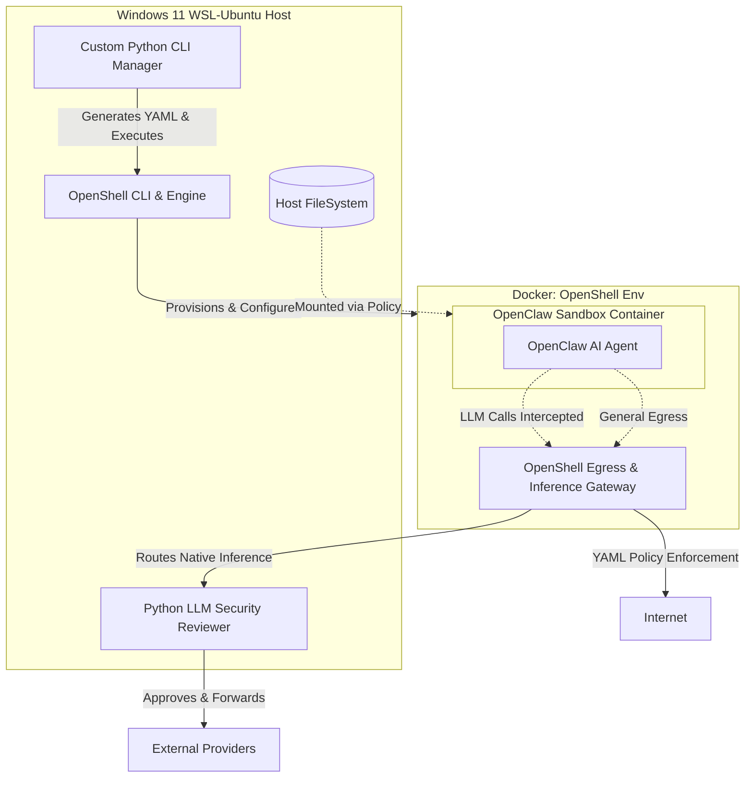
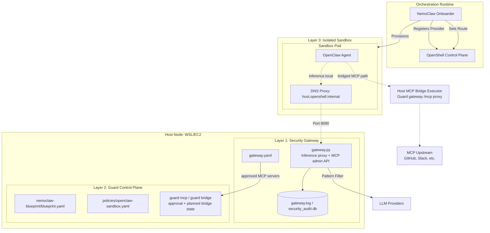
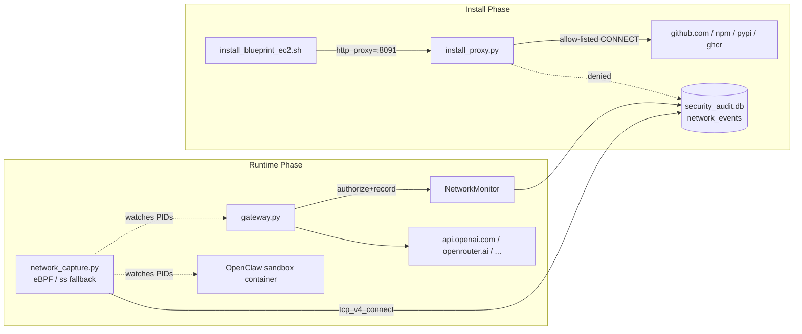
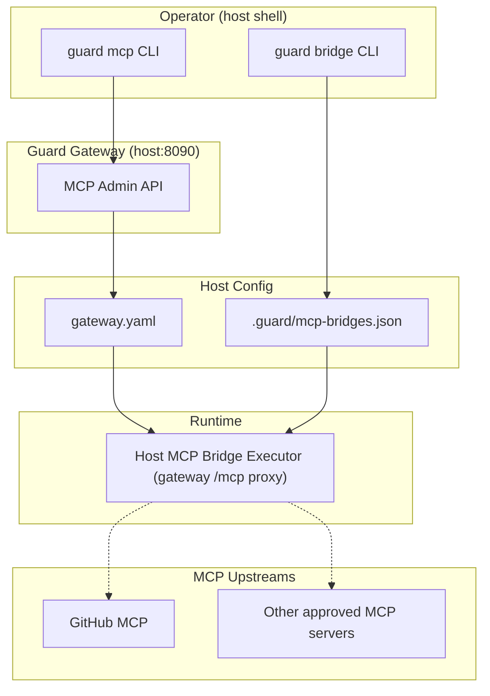

# OpenClaw SECURE Guard: Comprehensive Implementation Plan

This document outlines the strategic deployment of the OpenClaw AI agent within a security-hardened environment powered by **NVIDIA OpenShell** and **NemoClaw**. It tracks the evolution from the initial custom CLI design to the modern, 100% Blueprint-driven architecture, and now the Guard-owned config split plus MCP governance layer.

---

## 1. Initial System Architecture (V1-V2)
*This section reflects the original architecture, leveraging a custom Python CLI to drive OpenShell directly.*



---

## 2. Requirement Breakdown & Evolution

### Requirement 1: Directory & External Access Management
*   **Evolution**: Switched to **Zero-Injection**. All mounts are declared in the NemoClaw Blueprint. Host directories are mounted as **Read-Only** volumes by the orchestrator before the sandbox starts.

### Requirement 2: Network & AI Model Connection Management
*   **Evolution**: Inference routing is now a first-class citizen in the **NemoClaw Layer 2 Blueprint**. `inference.local` is enforced by OpenShell kernel rules (Layer 3) to prevent any network bypass.

### Requirement 3: LLM Forwarding & Security Review
*   **Evolution**: The `gateway.py` (Layer 1) remains the security arbiter. It handles pattern matching (e.g., blocking `rm -rf`) and upstream provider failover (e.g., 429 retries).

### Requirement 4: Using NVIDIA OpenShell
*   **Successfully Adopted.** OpenShell orchestrates the Docker containers and kernel-level Landlock/Egress policies.

---

## 3. Current Effective Architecture (v8): Blueprint-Driven Inference + Guard MCP Compatibility Bridge
*As of April 2026. Inference is stably proxied through the Guard Gateway. Sandbox-native MCP runtime delivery through mapped `openclaw.json` is no longer treated as a stable integration point. The current implemented minimum is a Guard-owned HTTP bridge built on the existing gateway `/mcp/{server}` reverse proxy, with future room to expand toward broader compatibility patterns inspired by NemoClaw PR #565.*



### Key Breakthroughs (v5-v8)
1. **Validation Loop Resolution**: Mapping `host.openshell.internal` to `127.0.0.1` on the host side lets `nemoclaw onboard` validate the custom security gateway during installation.
2. **Permanent Guard Bridge Rule**: The base sandbox policy should permanently allow the chosen Guard bridge endpoint during installation. `host.openshell.internal:8090` can remain as a compatibility entry, but remote validation showed that it may resolve to `172.17.0.1` without providing a reachable host HTTP bridge, so product defaults should move toward an explicit external bridge host/domain.
2. **Mock Success Logic**: `gateway.py` detects NemoClaw onboarding probes and returns mock success, enabling non-interactive installation without real upstream LLM calls.
3. **Persistent Source Pattern**: Scripts bypass the official `nemoclaw.sh` bootstrap temp-dir bug by downloading the NemoClaw source tarball to `~/.nemoclaw/source/`, then running `scripts/install.sh` directly.
4. **Immediate Docker Access**: `sudo chmod 666 /var/run/docker.sock` avoids the common EC2 session restart lag for Docker access.
5. **Environment Persistence**: Installers update `~/.bashrc` with required `PATH` and `nvm` exports for permanent command availability.
6. **Blueprint Pre-merge**: Custom blueprint content is synced into the NemoClaw source tree before `install.sh` runs, so the first onboard uses Guard's config directly.
7. **Gateway Systemd Service**: `guard-gateway.service` provides auto-start on EC2 reboot and crash recovery.
8. **OpenClaw 2026.4.2 Baseline**: The project now stays on OpenClaw `2026.4.2`, which already provides the native MCP capability required for the current design.
9. **Provider Auto-selection Guardrail**: The installer temporarily masks direct provider keys during onboarding so NemoClaw does not auto-select NVIDIA/OpenAI/etc. instead of the intended custom endpoint flow.
10. **Stale Source Cache Guardrail**: `~/.nemoclaw/source` is refreshed automatically when its cached OpenClaw baseline does not match the requested `OPENCLAW_VERSION`.
11. **MCP Architecture Reset**: EC2 validation showed that treating mapped `openclaw.json` as the stable MCP runtime source is unreliable on the normal NemoClaw path, so the project moved MCP toward a Guard-governed host-to-sandbox bridge model, with the minimal HTTP executor now implemented on top of the existing gateway reverse proxy.
---

## 4b. Model Setup Wizard (`guard/wizard.py`)

The setup wizard bridges the gap between `.env` key configuration and the runtime model selection that was previously hardcoded.

### Problem
Previously, `NEMOCLAW_MODEL` was hardcoded to `nvidia/nemotron-3-super-120b-a12b:free` in install scripts. Users who configured `OPENAI_API_KEY` or `ANTHROPIC_API_KEY` still got the OpenRouter free model by default, with no way to choose during installation.

### Solution Architecture
```
.env (API keys) -> wizard.py -> Tests connectivity per provider
                              |
                              +-> Presents numbered model menu
                              |   (only reachable providers shown)
                              |
                              +-> Writes MODEL_ID to .env
                              +-> Patches blueprint.yaml
                                 (inference.profiles.default.model)
```

### Execution Flow in `install_blueprint_ec2.sh` (legacy)

> **Note**: For MCP-enabled deployments, use `ec2_ubuntu_start.sh` instead (see Section 9.2).

```
Step 0:  System dependencies (apt-get)
Step 1:  Python venv + pip install
Step 1b: wizard.py (reads .env, tests APIs, user picks model; TTY auto-detect)
Step 2:  Start gateway.py (with MODEL_ID from wizard.py)
Step 3:  Download NemoClaw source tarball (persistent ~/.nemoclaw/source/)
Step 3b: Pre-merge Guard Blueprint into source tree (all policies/*, not just presets)
Step 3c: (Optional) If OPENCLAW_VERSION set: build Dockerfile.base locally
Step 3d: Run official scripts/install.sh (NEMOCLAW_REPO_ROOT -> Path A from source)
Step 4a: Persist PATH to ~/.bashrc
Step 4b: Configure systemd guard-gateway.service (auto-start on reboot)
```

### Key Design Decisions
- **Runs before gateway**: `wizard.py` tests upstream providers directly (not via the local gateway) so it works on a fresh install.
- **Writes both `.env` and `blueprint.yaml`**: `.env` is consumed by `gateway.py` and start scripts; `blueprint.yaml` is consumed by NemoClaw onboard.
- **TTY auto-detect**: `sys.stdin.isatty()` auto-switches to non-interactive when no terminal is attached (CI/SSH without `-t`). Override with `--interactive` or `--non-interactive` flags.
- **No new dependencies**: Uses `httpx` and `pyyaml` already in project dependencies.

---

## 5. Blueprint Loading Mechanism: The "Global Sync" Strategy

To ensure NemoClaw consumes the project-specific blueprint without requiring complex CLI path injections, the system employs a **Global Source Synchronization** mechanism.

### The Mechanism
NemoClaw's onboarding engine uses a prioritized search path for blueprints. The primary authoritative location is the user's global configuration directory: `~/.nemoclaw/source/nemoclaw-blueprint/`.

### Implementation Steps (v2: Pre-merge)
1.  **Source Download**: The installer downloads the NemoClaw source tarball to `~/.nemoclaw/source/` (bypassing the official `nemoclaw.sh` bootstrap which has a temp-dir cleanup bug).
2.  **Pre-merge**: Before running `install.sh`, the installer copies official policy presets into our project directory, then uses `rsync -a --delete` to overwrite the source tree's `nemoclaw-blueprint/` with our custom version.
3.  **Single Onboard**: `install.sh` runs its built-in onboard step, which automatically uses the pre-merged blueprint. No second onboard is needed.
4.  **Cross-Layer Binding**: The blueprint defines relative mappings (e.g., `sandbox_workspace/openclaw`), and NemoClaw binds host-side configuration (Layer 2) to the sandbox runtime (Layer 3).

This strategy guarantees that the **Source of Truth** always resides within the version-controlled repository while remaining perfectly compatible with NemoClaw's standardized deployment lifecycle.

---

## 5b. OpenClaw Version Override Strategy

### Problem
The GHCR base image (`ghcr.io/nvidia/nemoclaw/sandbox-base:latest`) pins a specific OpenClaw version (e.g., `2026.3.11`). Users may need a newer or different version without waiting for the GHCR image to be updated.

### Failed Approaches
1. **`sed` on `Dockerfile.base` only**: The sandbox `Dockerfile` uses `FROM ghcr.io/...sandbox-base:latest` - it pulls the pre-built GHCR image, ignoring local `Dockerfile.base` modifications.
2. **Inject `RUN npm install -g openclaw@X` into sandbox `Dockerfile`**: Creates a new Docker layer with the second copy of openclaw. Due to Docker's overlay filesystem, the old version in the base layer cannot be removed, resulting in **+1.7GB image bloat** (4.1GB vs 2.4GB). The OpenShell gateway's image upload times out on constrained instances.
3. **Merge `npm install` into existing `RUN` layer**: Same 4.1GB result - npm downloads to cache + installs new openclaw, while old version persists in base layer below.

### Working Solution: Local Base Image Build
```
.env (OPENCLAW_VERSION=2026.4.2)
    |
    v
sed on Dockerfile.base: openclaw@2026.3.11 -> openclaw@2026.4.2
    |
    v
docker build -f Dockerfile.base -t ghcr.io/nvidia/nemoclaw/sandbox-base:latest .
    |
    v
nemoclaw onboard -> sandbox Dockerfile FROM ${BASE_IMAGE} -> uses local image
    |
    v
Sandbox has openclaw@2026.4.2 (image size: ~2.2GB, same as default)
```

The local build tags the image with the same name as the GHCR image, so Docker's `FROM` directive uses the local version instead of pulling from GHCR. The resulting image is actually slightly smaller (~2.2GB vs ~2.4GB) because it only contains one version of openclaw.

---

## 5c. Gateway Persistence (systemd)

### Problem
The gateway was started via `nohup`, which doesn't survive EC2 reboots. Manual intervention was required after every reboot.

### Solution
The installer creates a systemd service `guard-gateway.service`:
- **Auto-start on boot** (`WantedBy=multi-user.target`)
- **Crash recovery** (`Restart=always`, `RestartSec=3`)
- **Environment from `.env`** (`EnvironmentFile=$PROJECT_DIR/.env`)
- **Replaces nohup**: The installer kills the `nohup` gateway before enabling systemd

The `nohup` launch in Step 2 is still needed for the installation process itself (NemoClaw onboard requires a running gateway), but systemd takes over in Step 4b.

---

## 6. Operational Workflow

### Installation (Zero-to-Hero)

**AWS EC2 (recommended for full inference deployment and MCP governance work):**
```bash
bash ec2_ubuntu_start.sh    # normal NemoClaw install + Guard-managed inference path
```

**Separate MCP rollout after base install:**
```bash
export GUARD_BRIDGE_HOST=bridge.example.com
export GUARD_BRIDGE_PORT=8090
bash install_mcp_bridge.sh --all
```

**Legacy / WSL installers (without MCP onboard flow):**
```bash
./install_blueprint_wsl.sh  # For Windows WSL
./install_blueprint_ec2.sh  # For AWS EC2 (legacy, no MCP registration)
```

### Runtime Path: Inference
1.  **Request**: OpenClaw in sandbox sends model requests to `https://inference.local/v1`.
2.  **Interception**: OpenShell egress policy redirects this to `http://host.openshell.internal:8090/v1`.
3.  **Audit**: `gateway.py` on the host intercepts the request, checks for dangerous commands (like `rm -rf /`), and logs the audit.
4.  **Forward**: If safe, the gateway forwards the request to the real provider (OpenRouter/OpenAI/Anthropic) using API keys from the host's `.env`.

### Runtime Path: MCP (implemented minimal execution plane)
1.  **Register**: Guard writes approved MCP server metadata to `gateway.yaml` through the admin API.
    Public custom MCP servers can now use the product-facing path `guard mcp install <name> <url> ...` without `--credential-env`; credential injection remains optional and only applies when the upstream actually needs a bearer token.
2.  **Plan**: `guard bridge add <name> --sandbox <sandbox>` records the intended host-to-sandbox bridge in `.guard/mcp-bridges.json`.
3.  **Activate**: `guard bridge activate <name> --sandbox <sandbox>` marks the bridge active and binds it to the Guard gateway runtime on port `8090` by default.
4.  **Execute**: `guard.gateway` serves `/mcp/{server}` and `/v1/mcp/{server}` as the minimal host-side HTTP bridge executor for approved HTTP MCP upstreams.
5.  **Primary consumer: native OpenClaw bundle MCP**: Guard can now render or stage the OpenClaw `4.2` bundle plugin files required for native MCP tool injection. The bundle `.mcp.json` must use `url` and optional `transport`, not `baseUrl`.
6.  **Optional debug consumer: mcporter**: The sandbox can still register the rendered bridge URL through `mcporter config add ... --transport <mcporter-transport> --scope home` for inspection/debugging. Guard's `streamable_http` bridge mode maps to `mcporter`'s `http` transport.
7.  **Host alias selection**: For host-routed bridge URLs, the product should prefer an explicit external bridge host/domain first, then a validated host private IP if needed. `host.openshell.internal` remains a compatibility fallback only. In the validated EC2 runtime, direct `172.17.0.1:8090` access returned `ECONNREFUSED`, while proxied requests to `http://host.openshell.internal:8090/...` succeeded through the default sandbox proxy path.
8.  **SSRF override for private bridge hosts**: when the chosen bridge host resolves to private RFC1918 space, Guard onboarding must render matching `allowed_ips` for the `guard_bridge_host` endpoint. `GUARD_BRIDGE_ALLOWED_IPS` is now the install-time escape hatch for compatibility aliases such as `host.openshell.internal`, and `ec2_ubuntu_start.sh` auto-detects the local Docker bridge IP before generating the final policy.
9.  **Current limitation**: automatic in-sandbox placement of the native bundle plugin is now scriptable on the host side, but the overall MCP rollout still needs tighter productization. Non-HTTP/stdin MCP execution is still future work.

Validation note: direct sandbox `POST initialize` requests against the Guard bridge URL are the right protocol-level check, but April 15, 2026 remote EC2 validation also showed an important topology constraint: `host.openshell.internal` can be approved in policy yet still resolve to `172.17.0.1` with `ECONNREFUSED`, and direct host private/public IP access to `:8090` can also fail from the sandbox. In other words, bridge approval and bridge reachability are separate concerns. `inference.local` also failed as a generic MCP bridge path with policy restrictions, so it should remain inference-only rather than a sandbox MCP bridge URL.

Additional validation note: when the Guard bridge was exposed through a bundle plugin under `/sandbox/.openclaw/extensions/<plugin-id>/` and the bundle `.mcp.json` used:

```json
{
  "mcpServers": {
    "github": {
      "url": "http://host.openshell.internal:8090/mcp/github/",
      "transport": "streamable-http"
    }
  }
}
```

OpenClaw `2026.4.2` surfaced native GitHub MCP tools inside `openclaw agent --json` `systemPromptReport.tools.entries`, including `github__get_me`. This confirms that OpenClaw `4.2` already has the required native runtime support; no `4.10` upgrade is required just for HTTP MCP tool injection.

Latest EC2 validation also confirmed that `openclaw tui` could successfully call GitHub MCP and return live repository results from inside the sandbox, so the path is now validated at the interactive user level, not just at the schema/tool-discovery layer.

Most recent EC2 validation tightened that conclusion further:

- Staging the bundle directly into the host-mapped extension root `sandbox_workspace/openclaw-data/extensions/guard-mcp-bundle/` was enough for the running sandbox to discover it through `/sandbox/.openclaw/extensions/guard-mcp-bundle/`.
- A native agent call asking GitHub MCP for the current login returned `bforecast`, proving live tool execution rather than only tool discovery.
- The previously discussed `openclaw.json` plugin-enable mutation is therefore no longer treated as a required production step for the validated 2026.4.2 path.

Additional April 15, 2026 product-path validation:

- Guard CLI was updated so public custom MCP servers no longer require `--credential-env` during `guard mcp install`.
- Re-testing with
  `guard mcp install earnings https://earnings-mcp-server.brilliantforecast.workers.dev/mcp --transport streamable_http --by admin`
  succeeded on EC2 and produced:
  - approved MCP registry entry
  - runtime allowlist entry for `earnings-mcp-server.brilliantforecast.workers.dev:443`
  - `Credential env: -`
- Remaining failure for that specific `earnings` server is now isolated to the upstream MCP endpoint returning `HTTP 403` on initialize, not to Guard registration / approval / bridge activation.

### Maintenance
*   **Security Rules**: Modify `guard/gateway.py` to add new blocking patterns.
*   **Network Policies**: Update `gateway.yaml` `network.{install,runtime}` sections, then `POST /v1/network/policy/reload` to hot-reload without restart.
*   **MCP Servers**: Use `guard mcp install`, `guard mcp approve`, and `guard bridge add` to manage approved MCP definitions and planned bridge attachments.
*   **Artifact Sync**: Re-run `guard onboard` when blueprint structure or inference artifacts change. MCP bridge runtime materialization is separate follow-up work.
---

## 7. Network Authorization & Real-time Detection (V6)

Adds an explicit network layer that complements the existing pattern matching, plugging two long-standing gaps:

1.  **Install-time blind spot** - `install_blueprint_*.sh` previously trusted any host that `curl`/`pip`/`npm` reached during Step 3.
2.  **Runtime invisibility** - `gateway.py` only audited *which provider/model* a request hit, never *which TCP endpoint* the host actually connected to, nor whether sandbox processes were performing out-of-band egress.

### 7.1 Architecture



### 7.2 Components

| Component | Layer | Backend | Default |
|---|---|---|---|
| `network_monitor.py` | Library | sqlite3 | n/a |
| `install_proxy.py` | Install proxy on `127.0.0.1:8091` | stdlib socket + select | `default: deny` |
| `gateway.py` upstream hooks | Application | httpx interception | `default: warn` |
| `network_capture.py` | Kernel daemon | bcc eBPF, ss fallback | `default: warn` |

### 7.3 Decision Model

`NetworkMonitor.authorize(host, port, scope)` returns one of:
- `allow` - entry matched, `enforcement=enforce`
- `warn` - recorded with non-fatal reason
- `monitor` - recorded silently
- `block` - `default=deny` + no entry, or rate limit exceeded

Per-entry `rate_limit: { rpm: N }` uses a 60-second sliding window keyed on `host`. Hot-reload via `POST /v1/network/policy/reload` clears the rate buckets.

### 7.4 systemd

Two units, `EnvironmentFile` of `.env`:
- `guard-gateway.service` - runs as the install user, app-layer monitor + LLM router
- `guard-network-capture.service` - runs as `root` (eBPF requires `CAP_BPF`/`CAP_SYS_ADMIN`), eBPF or `ss` fallback

### 7.5 Deliberate Non-goals

- TLS termination (no MitM, no CA injection - splice-only)
- DNS sinkhole (handled separately if needed)
- Egress quotas / billing
- Webhook alert delivery (the audit table is the integration point)

---

## 8. Guard-owned Config Split + MCP Governance (V7)

This is the current architectural step introduced by the plan in `C:\Users\bfore\.claude\plans\glistening-toasting-gizmo.md` and now implemented in the repository.

### 8.1 Why the refactor was needed

Two layering issues existed in the previous design:

1. `nemoclaw-blueprint/blueprint.yaml` was being used as a dumping ground for Guard-owned `network.*` data that NemoClaw does not consume.
2. Guard CLI network mutations were directly editing YAML on disk even though the system is increasingly centered around HTTP-administered gateway behavior.

To fix that cleanly, Guard-owned policy moved into a separate config file and MCP governance was built on top of that boundary.

### 8.2 New ownership model

- `nemoclaw-blueprint/blueprint.yaml`
  - NemoClaw-owned fields only: sandbox, inference profiles, policy, mappings.
- `gateway.yaml`
  - Guard-owned fields: `network.install`, `network.runtime`, and `mcp.servers`.

Example shape:

```yaml
version: 1

network:
  install:
    default: deny
    allow:
      - host: github.com
        ports: [443]
        purpose: NemoClaw source tarball
  runtime:
    default: warn
    allow:
      - host: openrouter.ai
        ports: [443]
        purpose: OpenRouter upstream

mcp:
  servers:
    - name: github
      url: https://api.githubcopilot.com/mcp/
      transport: streamable_http
      credential_env: GITHUB_MCP_TOKEN
      status: approved
      registered_at: 2026-04-13T22:04:06Z
      approved_at: 2026-04-13T22:04:06Z
      approved_by: admin
      purpose: GitHub MCP (repos, issues, PRs, code search)
```

### 8.3 Code changes delivered

- New file `gateway.yaml` at the project root.
- New module `guard/gateway_config.py` for Guard-owned YAML I/O and MCP server operations.
- `guard/blueprint_io.py` reduced to NemoClaw-relevant helpers such as `set_default_model`.
- `guard/network_monitor.py`, `guard/network_capture.py`, `guard/onboard.py`, and `guard/wizard.py` now read/write Guard policy from `gateway.yaml`.
- New migration script `tools/migrate_blueprint_to_gateway.py` to move `network:` out of `nemoclaw-blueprint/blueprint.yaml`.

### 8.4 MCP Architecture

The current implemented MCP architecture is now split into:

- **Control plane implemented**:
  - Guard governs MCP registration, approval, audit, and allowlists in `gateway.yaml`.
  - Guard records planned bridge attachments in `.guard/mcp-bridges.json`.
- **Execution plane minimally implemented**:
  - Guard does **not** currently claim that mapped sandbox `openclaw.json` is a stable production path for MCP delivery.
  - Approved HTTP MCP upstreams can now be bridged through the existing gateway `/mcp/{server}` reverse proxy.
  - Future expansion can still follow the broader compatibility direction illustrated by NemoClaw PR #565.

#### 8.4.1 Current MCP architecture (implemented control plane + minimal runtime)



#### 8.4.2 Operational sequence

1. Operator runs `guard mcp install <name> --by <actor>`.
2. Guard writes the MCP definition to `gateway.yaml` and marks it approved.
3. Operator runs `guard bridge add <name> --sandbox my-assistant --workspace .`.
4. Operator runs `guard bridge activate <name> --sandbox my-assistant --workspace .`.
5. Guard records the bridge attachment in `.guard/mcp-bridges.json` and marks it active on the gateway-backed runtime.
6. Operator renders the bridge URL and registers it with the sandbox-side HTTP MCP client.

## 9. EC2 End-to-End Deployment & MCP Architecture Findings (V8)

This section documents the findings from full-stack EC2 deployment testing on April 12-13, 2026 and the resulting architectural corrections.

### 9.1 Deployment script: `ec2_ubuntu_start.sh`

The EC2 installer now stays on the normal NemoClaw path while preserving Guard-managed inference routing. MCP runtime delivery is no longer framed as a completed host-staged config injection solution.

Key differences from the earlier Guard-heavy flow:

| Aspect | Earlier EC2 flow | Current direction |
|--------|------------------|-------------------|
| `openclaw.json` ownership | Guard-generated, then uploaded/replaced post-install | NemoClaw-generated at image build time |
| Sandbox config mutation | Post-build injection and restart attempts | Avoided |
| Onboard count | `install.sh` plus an extra `nemoclaw onboard` | Single normal install path |
| MCP in installer | Pre-registered and injected into sandbox config | Governance only during install; runtime bridge remains follow-up work |
| Inference routing | Guard plus repeated correction steps | Guard endpoint supplied during install, then final `openshell inference set` |

### 9.2 Execution flow

```
Step 0:  System pre-checks (disk, memory)
Step 1:  Base dependencies (apt-get + expect)
Step 2:  Docker
Step 3:  Python venv + pip install -e .
Step 4:  Load .env keys + generate GUARD_ADMIN_TOKEN
Step 5:  Start Guard Gateway (:8090)
Step 6:  NemoClaw installation (source tarball + blueprint pre-merge + official install.sh)
         with direct provider keys temporarily masked to preserve custom-endpoint onboarding
         then set the final OpenShell inference route to Guard
```

This keeps the deployment aligned with how NemoClaw normally builds and locks sandbox config, which is exactly why the project stopped treating runtime `openclaw.json` mutation as the long-term MCP answer.

In practice, this also means the installer must control which credentials are visible to `install.sh`. If host-side provider keys such as `NVIDIA_API_KEY` are left in the environment, NemoClaw can prefer a direct NVIDIA/OpenAI/Anthropic route during onboarding. The current EC2 script avoids that by masking direct provider keys for the install step and restoring them immediately afterwards.

The installer must also control source freshness. If `~/.nemoclaw/source` is reused from an older experiment, the source-install path can silently inherit an older OpenClaw pin even when the project blueprint has moved on. The current EC2 script checks the cached `Dockerfile.base` version and refreshes the source tree automatically when it does not match the target baseline.

### 9.3 Key technical discoveries

#### 9.3.1 OpenClaw API key mechanism

OpenClaw 2026.4.2 reads API keys from `models.providers.{name}.apiKey` in `openclaw.json`, not from `auth-profiles.json` (which is for OAuth only). The value `"guard-managed"` is a placeholder 閳?real authentication is handled by the `inference.local` proxy via OpenShell. This version is now the pinned project baseline because its native MCP support is sufficient for the direct-MCP design, so the extra 2026.4.10 upgrade path is no longer needed.

```json
{
  "models": {
    "providers": {
      "openrouter": {
        "baseUrl": "https://inference.local/v1",
        "apiKey": "guard-managed",
        "request": { "allowPrivateNetwork": true },
        "models": [...]
      }
    }
  }
}
```

#### 9.3.2 `allowPrivateNetwork` flag

OpenClaw 2026.4+ blocks `inference.local` by default (SSRF guard). Each provider entry in `openclaw.json` requires `"request": {"allowPrivateNetwork": true}` to bypass this for the sandbox proxy hop.

#### 9.3.3 Sandbox binary paths

Binaries inside the sandbox are at `/usr/local/bin/`, not `/usr/bin/`. Network policy `binaries` entries must match exactly, or the OpenShell egress proxy rejects requests from those processes.

```yaml
binaries:
  - path: /usr/local/bin/openclaw
  - path: /usr/local/bin/node
```

#### 9.3.4 Sandbox config ownership

```
/sandbox/.openclaw/           (ro mount from sandbox_workspace/openclaw/)
  閳规壕鏀㈤埞鈧?openclaw.json           (immutable config: apiKey, models, MCP)
  閳规柡鏀㈤埞鈧?agents/ -> /sandbox/.openclaw-data/agents  (symlink)

/sandbox/.openclaw-data/      (rw mount from sandbox_workspace/openclaw-data/)
  閳规柡鏀㈤埞鈧?agents/main/agent/
        閳规柡鏀㈤埞鈧?auth-profiles.json
```

The important boundary is that `/sandbox/.openclaw/openclaw.json` is baked and hash-protected. Uploading rw auth artifacts is still valid for data dirs under `.openclaw-data`, but replacing `openclaw.json` itself is not a stable installer strategy.

#### 9.3.5 `openshell policy set` limitations

`openshell policy set` silently drops network policy entries that use `access: full`. Only entries with `protocol: rest` + `rules` format are applied. However, even correctly formatted entries beyond the base 3 (inference_local, openclaw_api, openclaw_docs) may not take effect.

For MCP host allowlisting, the supported mechanism remains NemoClaw policy presets plus the Guard-managed runtime allowlist in `gateway.yaml`. The current implementation keeps preset generation in Guard (`sandbox_policy.py`) and stages the mapped OpenClaw config separately through `guard mcp sync` or `guard onboard`.

Separately, the Guard bridge itself is now treated as install-time base infrastructure. The base sandbox policy still carries a compatibility rule for `host.openshell.internal:8090` for `openclaw`, `node`, `python3`, and `curl`, but runtime testing showed that this alias alone does not guarantee a reachable host-side HTTP bridge in remote deployments. The product direction therefore shifts toward an explicit external bridge host/domain first, with the compatibility alias retained only as a fallback.

#### 9.3.6 Model routing: `nvidia/` prefix

Models with `nvidia/` prefix (e.g., `nvidia/nemotron-3-super-120b-a12b:free`) are free-tier on OpenRouter, not NVIDIA direct API. Routing to `integrate.api.nvidia.com` returns 404. All `org/model` patterns now route to the `openrouter` provider:

```python
MODEL_ROUTES = [
    (r"^(gpt-|o1-|o3-|o4-|dall-e|tts-|whisper)", "openai"),
    (r"^claude-", "anthropic"),
    (r"^(openrouter/|nvidia/|meta/|mistralai/|google/|microsoft/|deepseek/|anthropic/|openai/)", "openrouter"),
]
```

### 9.4 MCP architecture status

Earlier EC2 experiments attempted to make MCP part of the installer by generating or replacing sandbox `openclaw.json` after installation. That approach is now considered structurally unsound because it conflicts with NemoClaw''s normal config lifecycle:

1. `openclaw.json` is written in the sandbox image build.
2. Its hash is pinned at build time.
3. The entrypoint verifies integrity at startup.

As a result, the project no longer treats 鈥渋nstaller-time MCP injection鈥?as the primary path. The current status is:

- inference routing through Guard is part of the supported EC2 installer
- MCP control-plane work in Guard remains useful
- sandbox MCP installation must be redesigned around a supported NemoClaw/OpenClaw flow

Symptoms seen in EC2 testing that motivated this change:

- `openclaw mcp list` was empty even after Guard-side MCP registration
- the running sandbox model could fall back to NemoClaw''s own defaults when multiple onboarding/config-mutation steps overlapped
- repeated OpenShell `pending` entries for `host.openshell.internal:<port>` even after approval, because the runtime kept resolving that alias to `172.17.0.1`
- `curl` and Node probes showed the same final failure mode: bridge access to `host.openshell.internal`, host private IP, and host public DNS name could still end in `ECONNREFUSED` from inside the sandbox

### 9.4.1 Additional April 15, 2026 bridge reachability finding

Remote EC2 validation refined the MCP bridge picture further:

- OpenShell may show network rules such as `host.openshell.internal:8090` with `allowed ips: 172.17.0.1`.
- This does **not** mean the Guard bridge is actually reachable.
- In the tested runtime, `host.openshell.internal` consistently resolved to `172.17.0.1`, but direct sandbox requests to that address returned `ECONNREFUSED`.
- Keeping the default sandbox proxy enabled changed the symptom from `ECONNREFUSED` to `403 Forbidden`, which indicates proxy-policy rejection rather than successful host-bridge routing.

Implementation implication:

- Guard should stop treating `host.openshell.internal` as the default bridge destination.
- `guard bridge detect-host-alias` should prefer an explicit external bridge host/domain or a validated host IP first.
- Documentation should explain that repeated `pending` entries can occur per binary/path even when a hostname-level rule appears to exist.

### 9.5 Verified end-to-end test results (EC2, 2026-04-13)

| Test | Result | Detail |
|------|--------|--------|
| Unit tests | 76/76 passed | Both local (Windows) and EC2 (Linux) |
| Inference chain | OK | Sandbox 閳?inference.local 閳?Guard Gateway 閳?OpenRouter 閳?"Hello!" |
| Dangerous prompt blocking | OK | `rm -rf` 閳?HTTP 403 Forbidden |
| GitHub MCP `get_repository` | OK | `torvalds/linux` 閳?"Linux kernel source tree, 228,472 stars" |
| GitHub MCP `search_repositories` | OK | Returned real search results |
| Gateway health | OK | `/health` returns providers + network_monitor status |
| Sandbox status | OK | `my-assistant` phase: Ready |

### 9.6 Code changes in this iteration

| File | Change |
|------|--------|
| `guard/gateway.py` | MODEL_ROUTES: `nvidia/` prefix routes to openrouter, not nvidia API |
| `guard/onboard.py` | Added `apiKey` + `allowPrivateNetwork` to all providers in `_write_openclaw_config()` |
| `guard/onboard.py` | Fixed binary paths from `/usr/bin/` to `/usr/local/bin/` in all policy entries |
| `guard/onboard.py` | Added rw data dir creation + mirrored auth writes for sandbox symlink target |
| `guard/onboard.py` | Changed `_project_network_policies` from `access: full` to `protocol: rest` + `rules` |
| `guard/onboard.py` | `_build_mcp_servers_config()` reads approved servers and resolves tokens from env |
| `guard/sandbox_policy.py` | New module: preset generation, file I/O, policy merge, sandbox apply |
| `ec2_ubuntu_start.sh` | Complete rewrite: 9-step flow, no docker ops, expect automation, correct ordering |
| `gateway.yaml` | Added `api.githubcopilot.com` to runtime allowlist |
| `tests/test_gateway.py` | Added nvidia/ routing + org-prefix routing tests |
| `tests/test_sandbox_policy.py` | New: preset structure, openclaw.json MCP + apiKey assertions |

### 9.7 Known limitations

1. **`openshell policy set` ceiling**: Only 3 base network policies are enforced by OpenShell regardless of how many are in the YAML. MCP hosts require NemoClaw presets.
2. **`nemoclaw policy-add` is interactive**: Automated via `expect`, but fragile if the TUI prompt format changes.
3. **Tokens in ro mount**: `openclaw.json` contains actual MCP tokens (resolved from env at onboard time). The file is read-only inside the sandbox but not encrypted. Future improvement: use a secret store or short-lived tokens.
4. **Single sandbox**: `ec2_ubuntu_start.sh` assumes a single sandbox named `my-assistant`. Multi-sandbox support would require parameterization.


