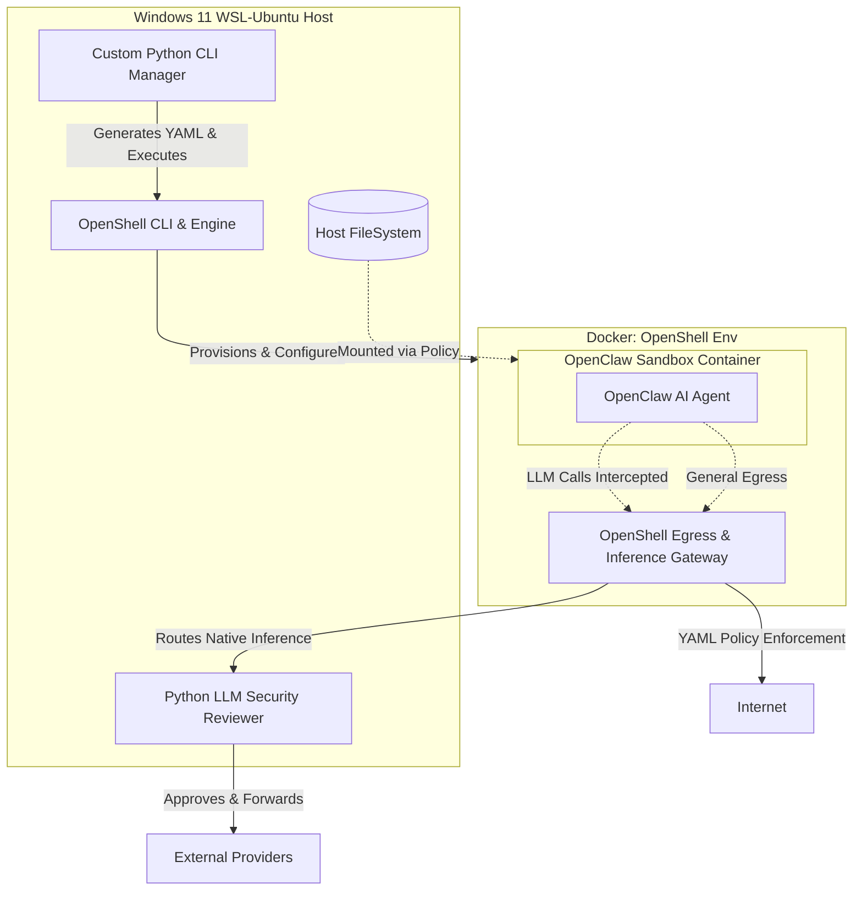
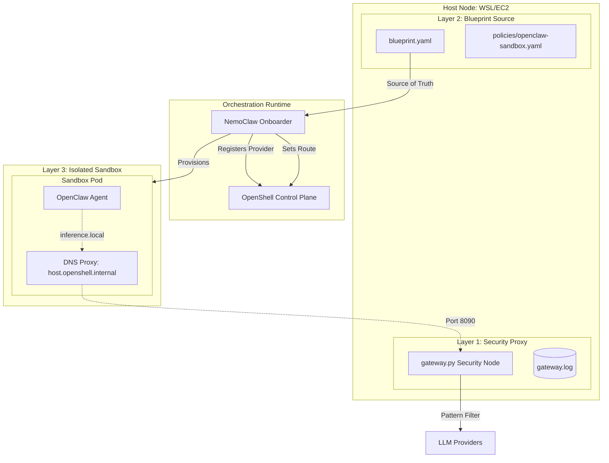
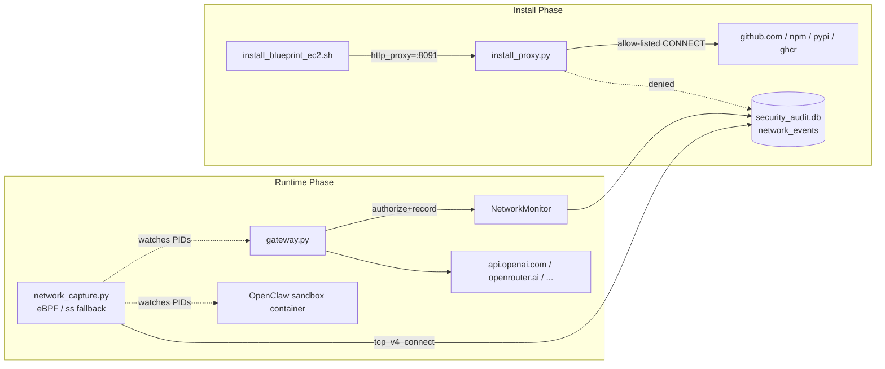

# OpenClaw SECURE Guard: Comprehensive Implementation Plan

This document outlines the strategic deployment of the OpenClaw AI agent within a security-hardened environment powered by **NVIDIA OpenShell** and **NemoClaw**. It tracks the evolution from the initial custom CLI design to the modern, 100% Blueprint-driven architecture.

---

## 1. Initial System Architecture (V1-V2)
*This section reflects the original architecture, leveraging a custom Python CLI to drive OpenShell directly.*



---

## 2. Requirement Breakdown & Evolution

### Requirement 1: Directory & External Access Management
*   **Evolution**: Switched to **Zero-Injection**. All mounts are declared in the NemoClaw Blueprint. Host directories are mounted as **Read-Only** volumes by the orchestrator before the sandbox starts.

### Requirement 2: Network & AI Model Connection Management
*   **Evolution**: Inference routing is now a first-class citizen in the **NemoClaw Layer 2 Blueprint**. `inference.local` is enforced by OpenShell kernel rules (Layer 3) to prevent any network bypass.

### Requirement 3: LLM Forwarding & Security Review
*   **Evolution**: The `gateway.py` (Layer 1) remains the security arbiter. It handles pattern matching (e.g., blocking `rm -rf`) and upstream provider failover (e.g., 429 retries).

### Requirement 4: Using NVIDIA OpenShell
*   **Successfully Adopted.** OpenShell orchestrates the Docker containers and kernel-level Landlock/Egress policies.

---

## 3. Current Effective Architecture (v5): 100% Blueprint-Driven
*As of April 2026, the system has achieved full declarative deployment without manual OpenShell command intervention.*



### Key Breakthroughs in v5:
1.  **Validation Loop Resolution**: By mapping `host.openshell.internal` to `127.0.0.1` on the host side, the `nemoclaw onboard` process can validate the custom security gateway during installation.
2.  **Mock Success Logic**: `gateway.py` now detects NemoClaw onboarding probes and returns mock success, enabling non-interactive installation without real upstream LLM calls.
3.  **Persistent Source Pattern**: Scripts bypass the official `nemoclaw.sh` bootstrap (which has a `trap rm -rf` bug that breaks npm symlinks) and instead download the NemoClaw source tarball to a persistent directory `~/.nemoclaw/source/`, then run `scripts/install.sh` directly. `NEMOCLAW_REPO_ROOT` is exported to force `is_source_checkout()` → Path A (from source), preventing `install.sh` from re-cloning and overwriting our customizations.
4.  **Immediate Docker Access**: A mandatory `sudo chmod 666 /var/run/docker.sock` bypasses the "session restart lag" common in cloud VM (EC2) deployments.
5.  **Environment Persistence**: Installer automatically updates `~/.bashrc` with required `PATH` and `nvm` exports for permanent command availability.
6.  **One-Click Installers**: `install_blueprint_wsl.sh` and `install_blueprint_ec2.sh` automate the entire stack.
7.  **Interactive Model Setup (`setup.py`)**: Before gateway/NemoClaw start, a setup wizard reads `.env`, tests real API connectivity for each configured provider, and lets the user choose a default model. The choice is written into both `blueprint.yaml` and `.env` (`MODEL_ID`), ensuring the full stack (gateway -> NemoClaw -> sandbox) uses the user's preferred model from the first boot. TTY auto-detection (`sys.stdin.isatty()`) enables non-interactive mode when no terminal is attached (CI/SSH without `-t`).
8.  **Blueprint Pre-merge**: Custom blueprint is synced into the NemoClaw source tree *before* `install.sh` runs, so the first onboard uses our config directly. This eliminates the need for a second onboard pass, saving ~3-5 minutes. All official policy files (not just presets) are preserved before `rsync --delete`.
9.  **Gateway Systemd Service**: `guard-gateway.service` provides auto-start on EC2 reboot and crash recovery (RestartSec=3), replacing the `nohup` approach which doesn't survive reboots.
10. **OpenClaw Version Override**: `OPENCLAW_VERSION` env var triggers a local build of `Dockerfile.base` (tagged as `ghcr.io/nvidia/nemoclaw/sandbox-base:latest`), so the sandbox `FROM` uses the locally-built base with the desired version. This avoids the +1.7GB image bloat from injecting `npm install` into the sandbox Dockerfile (which would create a second copy of openclaw in Docker's overlay FS).

---

## 4b. Model Setup Wizard (`src/setup.py`)

The setup wizard bridges the gap between `.env` key configuration and the runtime model selection that was previously hardcoded.

### Problem
Previously, `NEMOCLAW_MODEL` was hardcoded to `openrouter/stepfun/step-3.5-flash:free` in install scripts. Users who configured `OPENAI_API_KEY` or `ANTHROPIC_API_KEY` still got the OpenRouter free model by default, with no way to choose during installation.

### Solution Architecture
```
.env (API keys) ──► setup.py ──► Tests connectivity per provider
                                   │
                                   ├──► Presents numbered model menu
                                   │      (only reachable providers shown)
                                   │
                                   ├──► Writes MODEL_ID to .env
                                   └──► Patches blueprint.yaml
                                          (inference.profiles.default.model)
```

### Execution Flow in `install_blueprint_ec2.sh`
```
Step 0:  System dependencies (apt-get)
Step 1:  Python venv + pip install
Step 1b: setup.py (reads .env, tests APIs, user picks model; TTY auto-detect)
Step 2:  Start gateway.py (with MODEL_ID from setup.py)
Step 3:  Download NemoClaw source tarball (persistent ~/.nemoclaw/source/)
Step 3b: Pre-merge Guard Blueprint into source tree (all policies/*, not just presets)
Step 3c: (Optional) If OPENCLAW_VERSION set: build Dockerfile.base locally
Step 3d: Run official scripts/install.sh (NEMOCLAW_REPO_ROOT → Path A from source)
Step 4a: Persist PATH to ~/.bashrc
Step 4b: Configure systemd guard-gateway.service (auto-start on reboot)
```
Note: The previous Step 4 (second onboard) has been eliminated by pre-merging the blueprint before install.sh runs.

### Key Design Decisions
- **Runs before gateway**: setup.py tests upstream providers directly (not via the local gateway) so it works on a fresh install.
- **Writes both .env and blueprint.yaml**: `.env` is consumed by gateway.py and start scripts; `blueprint.yaml` is consumed by NemoClaw onboard.
- **TTY auto-detect**: `sys.stdin.isatty()` auto-switches to non-interactive when no terminal is attached (CI/SSH without `-t`). Override with `--interactive` or `--non-interactive` flags.
- **No new dependencies**: Uses `httpx` and `pyyaml` already in `requirements.txt`.

---

## 5. Blueprint Loading Mechanism: The "Global Sync" Strategy

To ensure NemoClaw consumes the project-specific blueprint without requiring complex CLI path injections, the system employs a **Global Source Synchronization** mechanism.

### The Mechanism
NemoClaw's onboarding engine uses a prioritized search path for blueprints. The primary authoritative location is the user's global configuration directory: `~/.nemoclaw/source/nemoclaw-blueprint/`.

### Implementation Steps (v2: Pre-merge)
1.  **Source Download**: The installer downloads the NemoClaw source tarball to `~/.nemoclaw/source/` (bypassing the official `nemoclaw.sh` bootstrap which has a temp-dir cleanup bug).
2.  **Pre-merge**: Before running `install.sh`, the installer copies official policy presets into our project directory, then uses `rsync -a --delete` to overwrite the source tree's `nemoclaw-blueprint/` with our custom version.
3.  **Single Onboard**: `install.sh` runs its built-in onboard step, which automatically uses the pre-merged blueprint. No second onboard is needed.
4.  **Cross-Layer Binding**: The blueprint defines relative mappings (e.g., `sandbox_workspace/openclaw`), and NemoClaw binds host-side configuration (Layer 2) to the sandbox runtime (Layer 3).

This strategy guarantees that the **Source of Truth** always resides within the version-controlled repository while remaining perfectly compatible with NemoClaw's standardized deployment lifecycle.

---

## 5b. OpenClaw Version Override Strategy

### Problem
The GHCR base image (`ghcr.io/nvidia/nemoclaw/sandbox-base:latest`) pins a specific OpenClaw version (e.g., `2026.3.11`). Users may need a newer or different version without waiting for the GHCR image to be updated.

### Failed Approaches
1. **`sed` on `Dockerfile.base` only**: The sandbox `Dockerfile` uses `FROM ghcr.io/...sandbox-base:latest` — it pulls the pre-built GHCR image, ignoring local `Dockerfile.base` modifications.
2. **Inject `RUN npm install -g openclaw@X` into sandbox `Dockerfile`**: Creates a new Docker layer with the second copy of openclaw. Due to Docker's overlay filesystem, the old version in the base layer cannot be removed, resulting in **+1.7GB image bloat** (4.1GB vs 2.4GB). The OpenShell gateway's image upload times out on constrained instances.
3. **Merge `npm install` into existing `RUN` layer**: Same 4.1GB result — npm downloads to cache + installs new openclaw, while old version persists in base layer below.

### Working Solution: Local Base Image Build
```
.env (OPENCLAW_VERSION=2026.4.2)
    │
    ▼
sed on Dockerfile.base: openclaw@2026.3.11 → openclaw@2026.4.2
    │
    ▼
docker build -f Dockerfile.base -t ghcr.io/nvidia/nemoclaw/sandbox-base:latest .
    │
    ▼
nemoclaw onboard → sandbox Dockerfile FROM ${BASE_IMAGE} → uses local image
    │
    ▼
Sandbox has openclaw@2026.4.2 (image size: ~2.2GB, same as default)
```

The local build tags the image with the same name as the GHCR image, so Docker's `FROM` directive uses the local version instead of pulling from GHCR. The resulting image is actually slightly smaller (~2.2GB vs ~2.4GB) because it only contains one version of openclaw.

---

## 5c. Gateway Persistence (systemd)

### Problem
The gateway was started via `nohup`, which doesn't survive EC2 reboots. Manual intervention was required after every reboot.

### Solution
The installer creates a systemd service `guard-gateway.service`:
- **Auto-start on boot** (`WantedBy=multi-user.target`)
- **Crash recovery** (`Restart=always`, `RestartSec=3`)
- **Environment from `.env`** (`EnvironmentFile=$PROJECT_DIR/.env`)
- **Replaces nohup**: The installer kills the nohup gateway before enabling systemd

The nohup launch in Step 2 is still needed for the installation process itself (NemoClaw onboard requires a running gateway), but systemd takes over in Step 4b.

---

## 6. Operational Workflow

### Installation (Zero-to-Hero)
Run the platform-specific installer:
```bash
./install_blueprint_wsl.sh  # For Windows WSL
./install_blueprint_ec2.sh  # For AWS EC2
```
During installation, the **Model Setup Wizard** (`src/setup.py`) will automatically detect configured API keys, test upstream connectivity, and prompt you to choose a default model. In non-interactive mode (CI), the first reachable model is auto-selected.

### Runtime Path
1.  **Request**: OpenClaw in sandbox sends model requests to `https://inference.local/v1`.
2.  **Interception**: OpenShell Egress Policy redirects this to `http://host.openshell.internal:8090/v1`.
3.  **Audit**: `gateway.py` on the host intercepts the request, checks for dangerous commands (like `rm -rf /`), and logs the audit.
4.  **Forward**: If safe, the gateway forwards the request to the real provider (OpenRouter/NVIDIA) using API keys from the host's `.env`.

### Maintenance
*   **Security Rules**: Modify `src/gateway.py` to add new blocking patterns.
*   **Network Policies**: Update `nemoclaw-blueprint/blueprint.yaml` `network.{install,runtime}` sections, then `POST /v1/network/policy/reload` to hot-reload without restart. The runtime allow-list is automatically projected into the OpenShell Landlock-style policy by `onboard.py:_project_network_policies()`.
*   **Artifact Sync**: Use `src/cli.py onboard` to regenerate sandbox configurations when blueprint structure changes.

---

## 7. Network Authorization & Real-time Detection (V6)

Adds an explicit network layer that complements the existing pattern matching, plugging two long-standing gaps:

1.  **Install-time blind spot** — `install_blueprint_*.sh` previously trusted any host that `curl`/`pip`/`npm` reached during Step 3.
2.  **Runtime invisibility** — `gateway.py` only audited *which provider/model* a request hit, never *which TCP endpoint* the host actually connected to, nor whether sandbox processes were performing out-of-band egress.

### 7.1 Architecture



### 7.2 Components

| Component | Layer | Backend | Default |
|---|---|---|---|
| `network_monitor.py` | Library | sqlite3 | n/a |
| `install_proxy.py` | Install proxy on `127.0.0.1:8091` | stdlib socket + select | `default: deny` |
| `gateway.py` upstream hooks | Application | httpx interception | `default: warn` |
| `network_capture.py` | Kernel daemon | bcc eBPF, ss fallback | `default: warn` |

### 7.3 Decision Model

`NetworkMonitor.authorize(host, port, scope)` returns one of:
- `allow` — entry matched, enforcement=enforce
- `warn` — recorded with non-fatal reason
- `monitor` — recorded silently
- `block` — default=deny + no entry, OR rate limit exceeded

Per-entry `rate_limit: { rpm: N }` uses a 60-second sliding window keyed on `host`. Hot-reload via `POST /v1/network/policy/reload` clears the rate buckets.

### 7.4 systemd

Two units, EnvironmentFile of `.env`:
- `guard-gateway.service` — runs as the install user, app-layer monitor + LLM router
- `guard-network-capture.service` — runs as `root` (eBPF requires CAP_BPF/CAP_SYS_ADMIN), eBPF or ss fallback

### 7.5 Deliberate Non-goals

- TLS termination (no MitM, no CA injection — splice-only)
- DNS sinkhole (handled separately if needed)
- Egress quotas / billing
- Webhook alert delivery (the audit table is the integration point)
