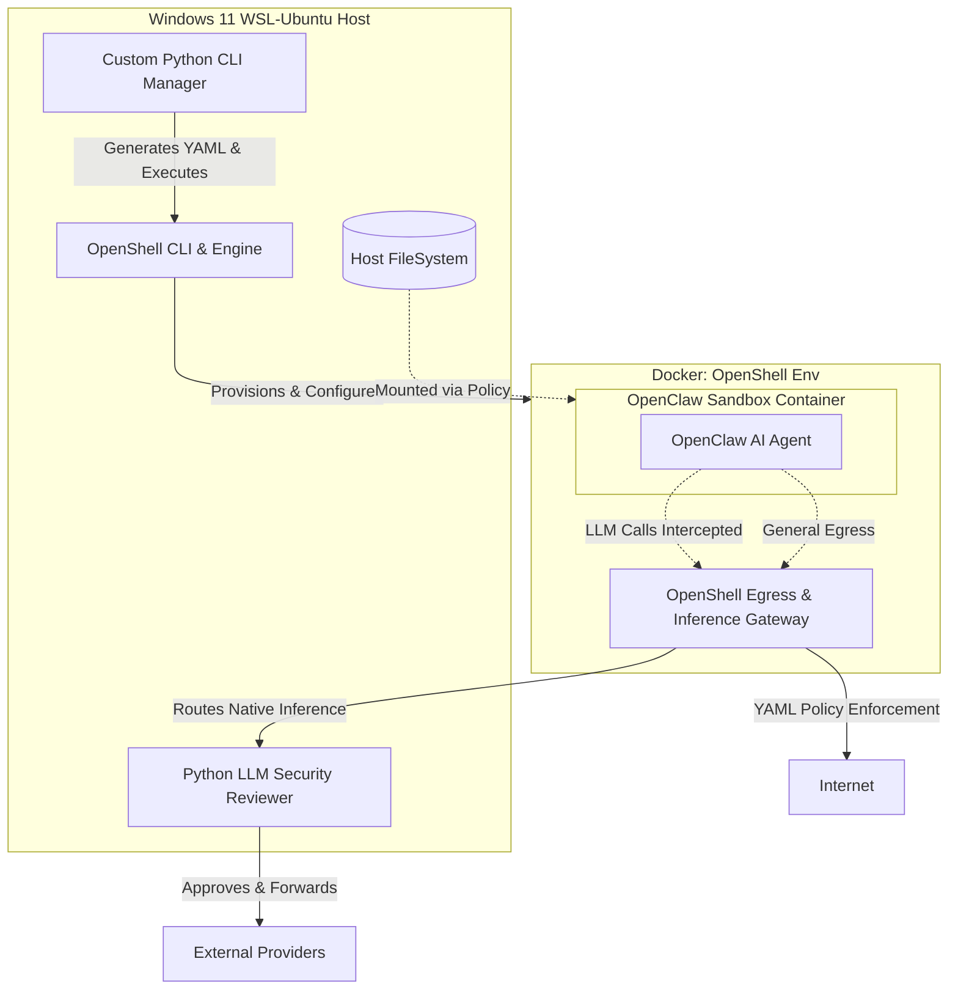
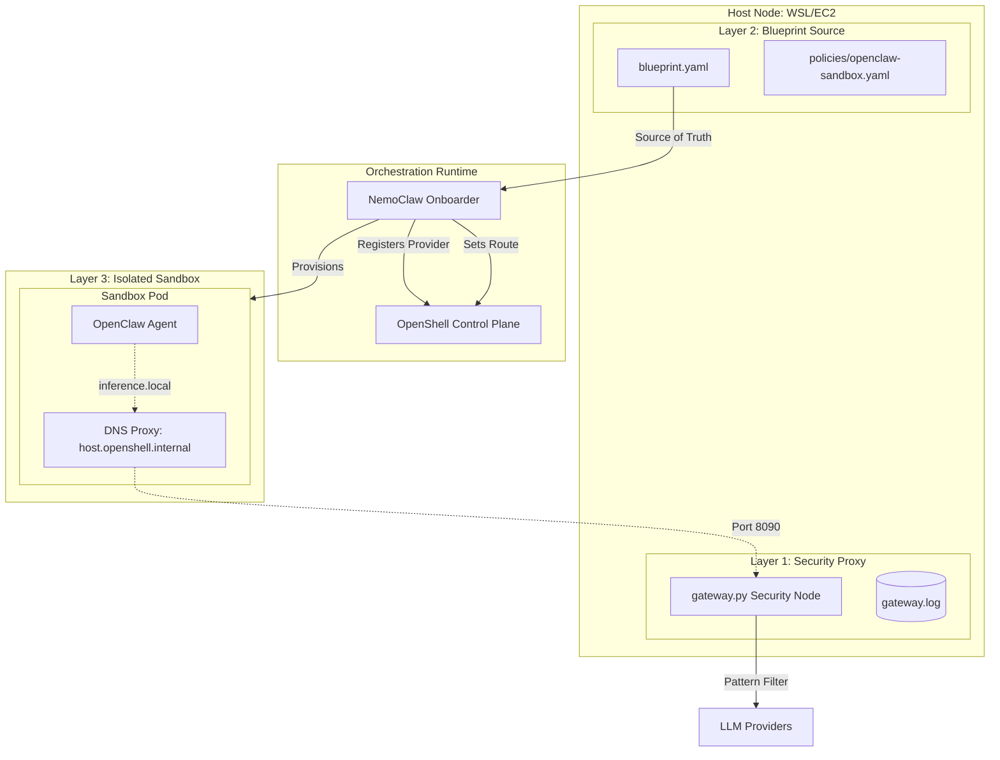

# OpenClaw SECURE Guard: Comprehensive Implementation Plan

This document outlines the strategic deployment of the OpenClaw AI agent within a security-hardened environment powered by **NVIDIA OpenShell** and **NemoClaw**. It tracks the evolution from the initial custom CLI design to the modern, 100% Blueprint-driven architecture.

---

## 1. Initial System Architecture (V1-V2)
*This section reflects the original architecture, leveraging a custom Python CLI to drive OpenShell directly.*



---

## 2. Requirement Breakdown & Evolution

### Requirement 1: Directory & External Access Management
*   **Evolution**: Switched to **Zero-Injection**. All mounts are declared in the NemoClaw Blueprint. Host directories are mounted as **Read-Only** volumes by the orchestrator before the sandbox starts.

### Requirement 2: Network & AI Model Connection Management
*   **Evolution**: Inference routing is now a first-class citizen in the **NemoClaw Layer 2 Blueprint**. `inference.local` is enforced by OpenShell kernel rules (Layer 3) to prevent any network bypass.

### Requirement 3: LLM Forwarding & Security Review
*   **Evolution**: The `gateway.py` (Layer 1) remains the security arbiter. It handles pattern matching (e.g., blocking `rm -rf`) and upstream provider failover (e.g., 429 retries).

### Requirement 4: Using NVIDIA OpenShell
*   **Successfully Adopted.** OpenShell orchestrates the Docker containers and kernel-level Landlock/Egress policies.

---

## 3. Current Effective Architecture (v5): 100% Blueprint-Driven
*As of April 2026, the system has achieved full declarative deployment without manual OpenShell command intervention.*



### Key Breakthroughs in v5:
1.  **Validation Loop Resolution**: By mapping `host.openshell.internal` to `127.0.0.1` on the host side, the `nemoclaw onboard` process can validate the custom security gateway during installation.
2.  **Mock Success Logic**: `gateway.py` now detects NemoClaw onboarding probes and returns mock success, enabling non-interactive installation without real upstream LLM calls.
3.  **Official Wrapper Pattern**: Scripts now invoke the official `nvidia.com/nemoclaw.sh` to ensure 100% compatibility with NVIDIA's evolving build and dependency logic.
4.  **Immediate Docker Access**: A mandatory `sudo chmod 666 /var/run/docker.sock` bypasses the "session restart lag" common in cloud VM (EC2) deployments.
5.  **Environment Persistence**: Installer automatically updates `~/.bashrc` with required `PATH` and `nvm` exports for permanent command availability.
6.  **One-Click Installers**: `install_blueprint_wsl.sh` and `install_blueprint_ec2.sh` automate the entire stack.

---

## 5. Blueprint Loading Mechanism: The "Global Sync" Strategy

To ensure NemoClaw consumes the project-specific blueprint without requiring complex CLI path injections, the system employs a **Global Source Synchronization** mechanism.

### The Mechanism
NemoClaw's onboarding engine uses a prioritized search path for blueprints. The primary authoritative location is the user's global configuration directory: `~/.nemoclaw/source/nemoclaw-blueprint/`.

### Implementation Steps
1.  **Authoritative Synchronization**: The installation scripts use `rsync -a --delete` to mirror the project's `./nemoclaw-blueprint/` folder into the global search path.
2.  **Implicit Loading**: When `nemoclaw onboard` is executed, it automatically discovers and loads the `blueprint.yaml` from this synchronized global location.
3.  **Cross-Layer Binding**: Since the blueprint defines relative mappings (e.g., `sandbox_workspace/openclaw`), and the command is executed from the project root, NemoClaw successfully binds the host-side configuration (Layer 2) to the sandbox runtime (Layer 3).

This strategy guarantees that the **Source of Truth** always resides within the version-controlled repository while remaining perfectly compatible with NemoClaw's standardized deployment lifecycle.

---

## 6. Operational Workflow

### Installation (Zero-to-Hero)
Run the platform-specific installer:
```bash
./install_blueprint_wsl.sh  # For Windows WSL
./install_blueprint_ec2.sh  # For AWS EC2
```

### Runtime Path
1.  **Request**: OpenClaw in sandbox sends model requests to `https://inference.local/v1`.
2.  **Interception**: OpenShell Egress Policy redirects this to `http://host.openshell.internal:8090/v1`.
3.  **Audit**: `gateway.py` on the host intercepts the request, checks for dangerous commands (like `rm -rf /`), and logs the audit.
4.  **Forward**: If safe, the gateway forwards the request to the real provider (OpenRouter/NVIDIA) using API keys from the host's `.env`.

### Maintenance
*   **Security Rules**: Modify `src/gateway.py` to add new blocking patterns.
*   **Network Policies**: Update `nemoclaw-blueprint/policies/openclaw-sandbox.yaml`.
*   **Artifact Sync**: Use `src/cli.py onboard` to regenerate sandbox configurations when blueprint structure changes.
