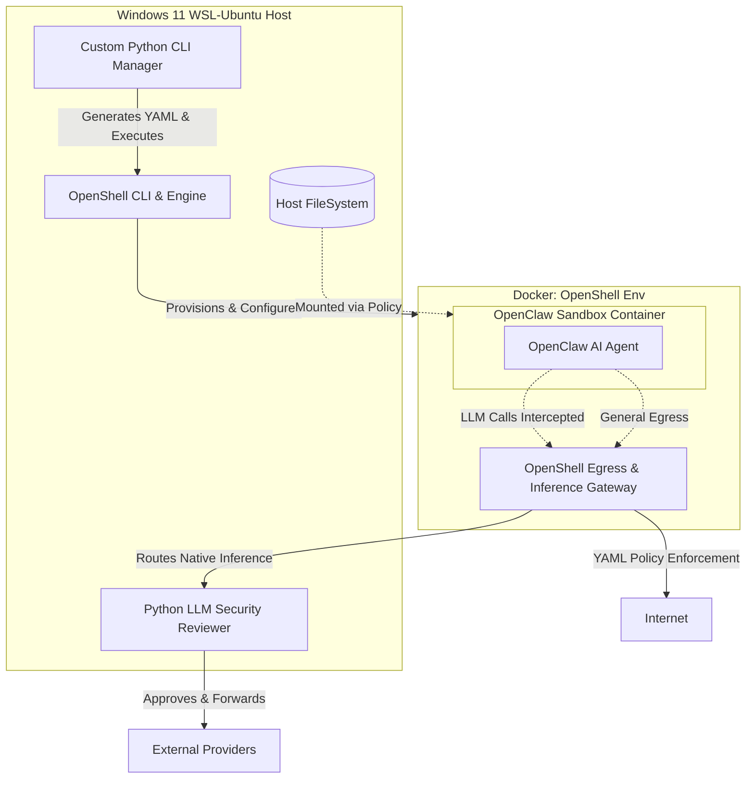

# OpenClaw SECURE Dockerization Plan (Powered by NVIDIA OpenShell)

Based on a deep analysis of NVIDIA OpenShell and the requirements provided in `requirement.txt`, this document outlines the revised architecture. OpenShell natively solves almost all the requirements by running a lightweight K3s cluster inside Docker to enforce network, file, and LLM boundaries.

## 1. System Architecture Diagram

## 2. Requirement Breakdown & Solutions

### Requirement 1: Directory & External Access Management
*   **Solution**: OpenShell provisions the agent sandbox seamlessly. Through our custom Python CLI, we dynamically generate OpenShell declarative YAML policies that selectively mount host directories into the OpenClaw sandbox. The OpenShell Gateway defaults to blocking all external access.

### Requirement 2: Network & AI Model Connection Management
*   **Solution**: OpenShell intercepts every outbound connection. We configure `openshell policy set` to allow specific target domains. The AI Model routing is handled natively by OpenShell's Inference Provider mapping, ensuring the agent cannot bypass the host's networking rules.

### Requirement 3: CLI Program Management
*   **Solution**: A Python CLI application (using `Typer` or `Click`) will act as the master controller. It abstracts OpenShell's commands, providing a streamlined, automated interface for the user to start OpenClaw, attach workspaces, and manage security policies without dealing with raw YAML files manually.

### Requirement 4: LLM Forwarding & Security Review
*   **Solution**: OpenShell natively intercepts LLM calls, strips caller credentials, and routes them. To achieve the "security review" requirement, we will configure the OpenShell Inference Provider to point to a local proxy: a lightweight Python FastAPI service running on the Host. This service will perform prompt scanning/logging before forwarding the authorized request to the actual LLM (OpenAI/Anthropic).

### Requirement 5: Using NVIDIA OpenShell
*   **Solution**: **Successfully Adopted.** OpenShell will be installed directly on the WSL-Ubuntu host. It will automatically orchestrate the Docker container sandboxes and the K3s policy enforcement layer. This replaces the complex and error-prone custom Docker/mitmproxy setup we previously considered, aligning perfectly with the architect's sandbox paradigm.

### Requirement 6: Development in Python
*   **Solution**:
    *   **Management CLI**: Python (`typer`/`subprocess` to drive `openshell`).
    *   **LLM Security Reviewer**: Python (`fastapi`, `litellm` or `httpx` to intercept, review, and relay LLM payloads).

## 3. Implementation Phasing
1. **Host Setup**: Install `openshell` natively on WSL-Ubuntu.
2. **LLM Reviewer**: Code the Python FastAPI proxy to review and log outgoing prompts.
3. **OpenShell Configuration**: Configure OpenShell Providers to route AI calls to the local Python LLM Reviewer.
4. **CLI Development**: Build the Python CLI to wrap `openshell sandbox create --from openclaw` and inject dynamic YAML network/file policies.
