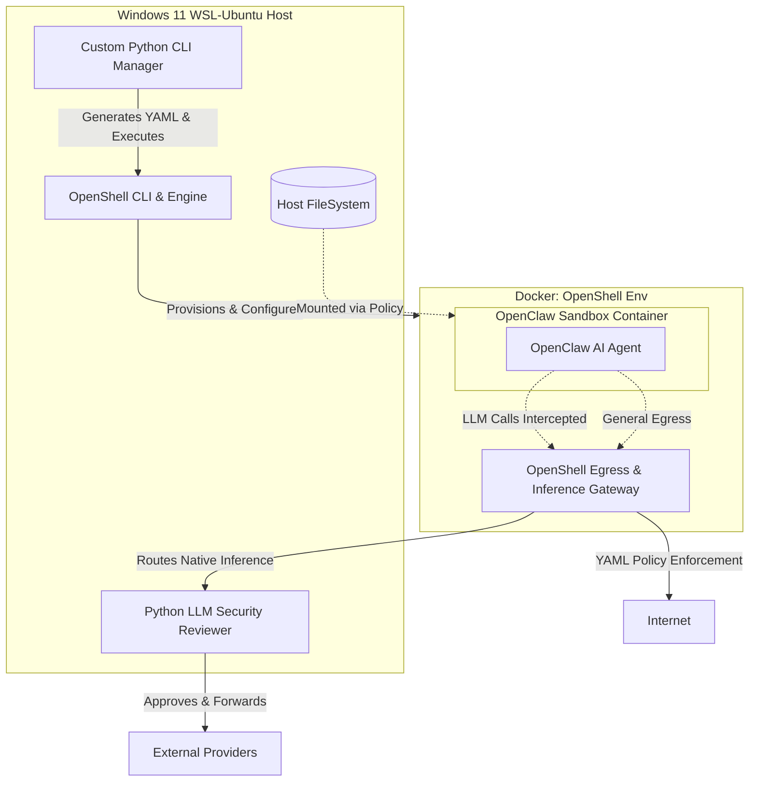
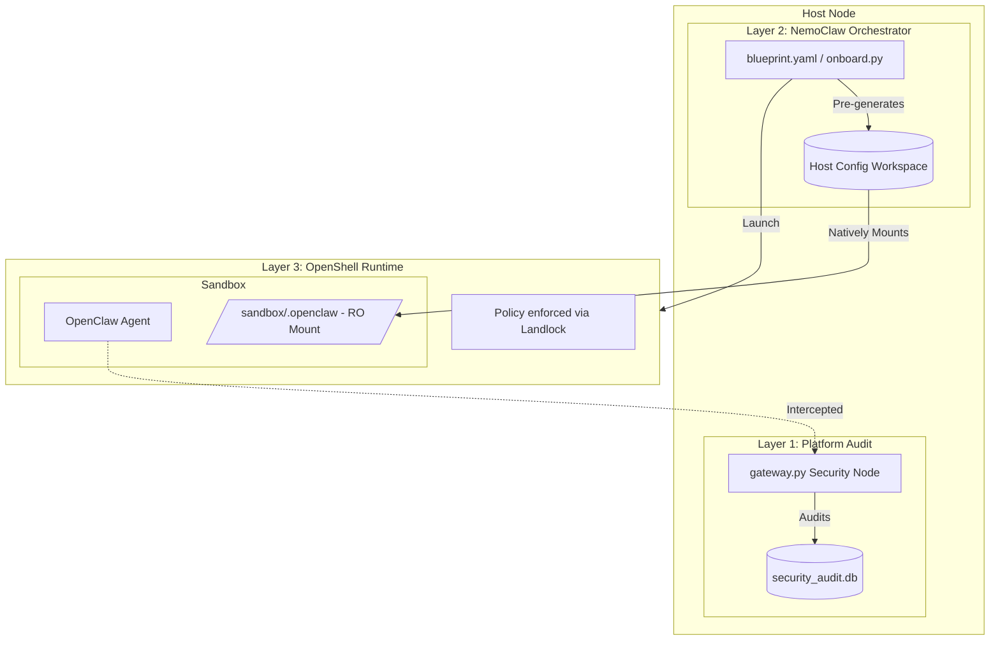

# OpenClaw SECURE Guard: Comprehensive Implementation Plan

This document outlines the strategic deployment of the OpenClaw AI agent within a security-hardened environment powered by **NVIDIA OpenShell** and **NemoClaw**. It tracks the evolution from the initial custom CLI design to the modern, three-layer "Zero-Injection" architecture.

---

## 1. Initial System Architecture (V1-V2)
*This section reflects the original GitHub architecture, leveraging a custom Python CLI to drive OpenShell directly.*

---

## 2. Requirement Breakdown & Solutions (Original v2 Mapping)

### Requirement 1: Directory & External Access Management
*   **Original Solution**: OpenShell provisions the agent sandbox. Through our custom Python CLI, we dynamically generate OpenShell declarative YAML policies that selectively mount host directories.
*   **Evolution (V4/NemoClaw)**: Switched to **Zero-Injection**. All mounts are declared in the NemoClaw Blueprint. Configs are pre-generated on the host and mounted as **Read-Only** volumes before the sandbox starts.

### Requirement 2: Network & AI Model Connection Management
*   **Original Solution**: OpenShell intercepts every outbound connection. We configure `openshell policy set` to allow specific target domains.
*   **Evolution (V4/NemoClaw)**: Inference routing is now a first-class citizen in the **NemoClaw Layer 2 Blueprint**. `inference.local` is enforced by OpenShell kernel rules (Layer 3) to prevent any network bypass.

### Requirement 3: CLI Program Management
*   **Original Solution**: A Python CLI application acting as the master controller to abstract OpenShell's commands.
*   **Evolution (V4/NemoClaw)**: We now leverage the **NemoClaw CLI** (`nemoclaw launch/connect`) as the standardized workload management entry point.

### Requirement 4: LLM Forwarding & Security Review
*   **Original Solution**: Configure OpenShell Inference Provider to point to a local proxy: a lightweight Python FastAPI service (`gateway.py`) on the Host.
*   **Evolution (V4/NemoClaw)**: The `gateway.py` remains the **Layer 1 Platform Node**, but its registration is handled declaratively in the `blueprint.yaml`.

### Requirement 5: Using NVIDIA OpenShell
*   **Successfully Adopted.** OpenShell orchestrates the Docker containers and kernel-level Landlock/Egress policies.

### Requirement 6: Development in Python
*   **Solution**: **Layer 1 Proxy** (FastAPI) and **Layer 2 Blueprint Setup** (Python) maintain the Python core of the project.

---

## 3. Evolutionary Architecture (v4): The Three-Layer Model
*To achieve the "Zero-Injection" target, we refined the architecture into three specialized layers.*

## 4. Current Effective Runtime (As Of 2026-03-31)

This section clarifies the currently effective control plane in production use.

1. **Sandbox egress entrypoint** is still `inference.local`.
2. **Actual forward target (`host.openshell.internal:8090`)** is determined by OpenShell provider config:
   - `openshell provider create ... --config OPENAI_BASE_URL=http://host.openshell.internal:8090/v1`
   - `openshell inference set --provider guard-gateway --model ...`
3. **Current `wsl_start.sh` flow does not explicitly set `NEMOCLAW_BLUEPRINT_PATH`**.
4. Therefore, **project-local `nemoclaw-blueprint/blueprint.yaml` is not automatically the runtime source of truth** unless explicitly synchronized/selected.

## 5. Blueprint-Driven Target State

To make blueprint the real source of truth end-to-end:

1. Generate artifacts via `src/cli.py onboard`.
2. Synchronize project `nemoclaw-blueprint/` into NemoClaw runtime blueprint directory before onboarding.
3. Run `nemoclaw onboard` after synchronization.
4. Validate that runtime blueprint and project blueprint are identical.
