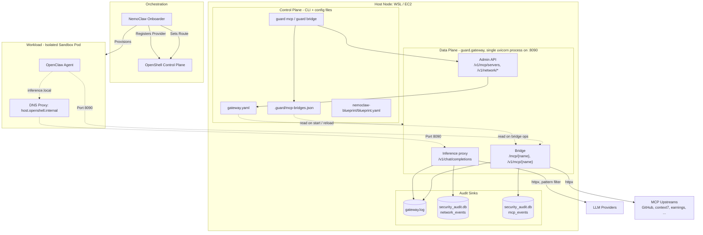
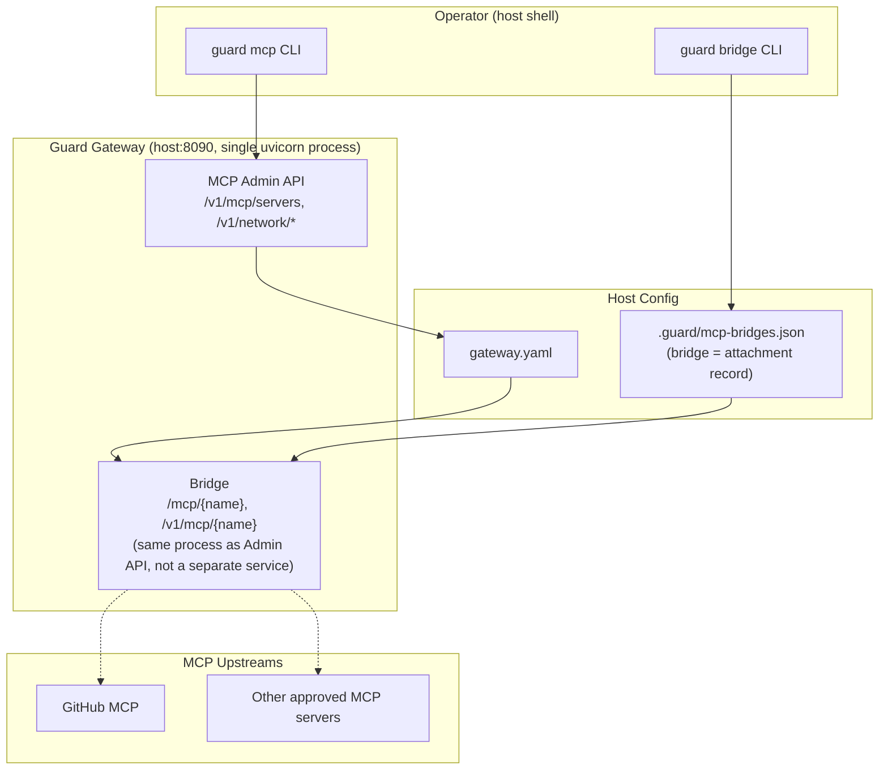

# OpenClaw Guard — Implementation Plan

Engineering reference for the Guard security layer around the NVIDIA OpenShell + NemoClaw + OpenClaw stack. Scope: what runs today, where the boundaries are, how to install and operate it.

> **Target audience**: engineers onboarding to the codebase, operators running the stack on WSL/EC2. For decision history and superseded approaches see [Appendix A](#appendix-a-decision-log).

---

## 1. Cheat Sheet

### 1.1 Pinned versions

| Component | Version | Notes |
|---|---|---|
| OpenClaw | `2026.4.2` | Native HTTP-MCP capable; no `4.10` upgrade needed |
| NemoClaw | source tarball from `~/.nemoclaw/source/` | Bypasses bootstrap temp-dir bug |
| OpenShell CLI | `0.0.26+` | Provides the sandbox orchestration and egress hooks |
| Python | 3.11+ | `.venv` at project root |

### 1.2 Ports

| Port | Bind | Who connects | Traffic |
|---|---|---|---|
| 8090 | `0.0.0.0` | Sandbox + host operator | Inference proxy + Bridge + Admin API (three route groups sharing one uvicorn process) |
| 8091 | `127.0.0.1` | `curl`/`pip`/`npm` during install | `install_proxy.py` HTTP CONNECT splice — install phase only |

### 1.3 Processes

| Process | systemd unit | Lifecycle |
|---|---|---|
| `guard.gateway` (uvicorn) | `guard-gateway.service` | Long-running; auto-restart |
| `network_capture.py` (eBPF / `ss` fallback) | `guard-network-capture.service` | Long-running; runs as `root` for `CAP_BPF` |
| `install_proxy.py` | ephemeral (nohup, trap EXIT) | Install phase only |

### 1.4 Key files

| File | Owner | Purpose |
|---|---|---|
| `gateway.yaml` | Guard | `network.install` / `network.runtime` / `mcp.servers` |
| `nemoclaw-blueprint/blueprint.yaml` | NemoClaw | Sandbox, inference profiles, mappings |
| `.guard/mcp-bridges.json` | Guard | Per-sandbox bridge (MCP attachment) records |
| `logs/gateway.log` | Guard | stderr of gateway process (business log + httpx + uvicorn access) |
| `logs/security_audit.db` | Guard | SQLite — `network_events` + `mcp_events` tables |
| `sandbox_workspace/openclaw-data/extensions/guard-mcp-bundle/.mcp.json` | Guard | Bundled sandbox-side MCP client config |

### 1.5 Terminology

- **Gateway** — the single `guard.gateway` uvicorn process on :8090. Three route groups: **Inference proxy** (`/v1/chat/completions`), **Bridge** (`/mcp/{name}`), **Admin API** (`/v1/mcp/servers`, `/v1/network/*`).
- **Bridge** — the gateway's MCP reverse-proxy route plus the attachment record in `.guard/mcp-bridges.json`. Not a separate process or port; implemented on top of the same gateway. Legacy name kept in `guard bridge` CLI.
- **Attachment** — synonym for bridge when referring to the state record.
- **Bundle** — the merged sandbox-side `.mcp.json` written to `sandbox_workspace/openclaw-data/extensions/guard-mcp-bundle/`, shared across all attachments for one OpenClaw install.

---

## 2. Architecture

### 2.1 Planes and data flow



The control plane is a **side channel** — the workload talks directly to the data plane on port 8090; the control plane only mutates configuration files and in-memory caches (via the Admin API).

### 2.2 Why three route groups share one port

Historical decision, not a design claim. The gateway grew inference → MCP proxy → admin API incrementally. Current consequences:

1. **Single bind `0.0.0.0:8090`** — the sandbox can reach all three namespaces. Admin API is gated by `GUARD_ADMIN_TOKEN` but the check has a fail-open branch when the token is unset (deployment footgun).
2. **URL namespace adjacency** — `/v1/mcp/{name}/` (bridge) and `/v1/mcp/servers` (admin) share a prefix; disambiguation is by exact string match on `servers`/`policy`/`events`, so no MCP server can be named any of those.
3. **Shared rate/audit pipeline** — but audit shapes differ (see §2.3).

A separate architecture review plan (`velvet-sleeping-trinket.md`) proposes tightening this: fail-closed admin token, `/admin/*` rename, optional loopback-only admin listener. That work is tracked, not yet scheduled.

### 2.3 Audit coverage asymmetry

Each signal is written at a different layer. Coverage is **not uniform** between the inference path and the bridge path.

| Signal | Inference (`/v1/chat/completions`) | Bridge (`/mcp/{name}`) |
|---|---|---|
| `gateway.log` — business line (`ALLOWED` / `BLOCKED` / `BRIDGE-ALLOWED` / `BRIDGE-BLOCKED`) | `ALLOWED` / `BLOCKED` on every request | `BRIDGE-ALLOWED` on success, `BRIDGE-BLOCKED [...] <category>` on block (categories: `not-found`, `not-approved`, `net-policy`, `upstream-error`) |
| `gateway.log` — httpx outbound line | yes | yes |
| `gateway.log` — uvicorn inbound access | yes | yes |
| `network_events` table (host/port/method/path/bytes/latency) | yes | **no** (gap) |
| `mcp_events` table (server_name/action/decision/actor) | no | yes (for `call` rows and governance actions) |

The `network_events` gap for bridge traffic is a known P2 item — see §6.

### 2.4 MCP sub-architecture



**Ownership boundary**:
- `gateway.yaml` holds `network.*` + `mcp.servers` — Guard-owned, mutated via the Admin API.
- `nemoclaw-blueprint/blueprint.yaml` holds only NemoClaw-consumed fields (sandbox, inference profiles, mappings). Guard no longer writes `network:` into the blueprint.

---

## 3. Install

### 3.1 Recommended paths

| Host | Script | Behavior |
|---|---|---|
| WSL (Windows) | `wsl_start.sh` → `install_blueprint_wsl.sh` | Full stack incl. MCP rollout |
| AWS EC2 Ubuntu | `ec2_ubuntu_start.sh` | Base stack (Guard + NemoClaw). Runs MCP rollout via `install_mcp_bridge.sh` as a second step. |

Why not the official `curl -fsSL https://www.nvidia.com/nemoclaw.sh | bash`? The upstream wrapper clones into `/tmp` and runs `trap 'rm -rf tmpdir'` on exit, which breaks `npm link` symlinks and leaves `nemoclaw` unusable. Guard also needs to (a) pre-merge its blueprint **before** NemoClaw's first internal onboard, and (b) temporarily unset direct-provider keys so NemoClaw selects the Guard custom endpoint. Neither hook is exposed by the official wrapper. Defaulting OpenClaw to 4.2 upstream does not change any of this — the bypass is about bootstrap lifecycle, not version pinning.

### 3.2 `ec2_ubuntu_start.sh` execution flow

```
Step 0  System pre-checks (disk, memory)
Step 1  Base dependencies (apt-get + expect)
Step 2  Docker
Step 3  Python venv + pip install -e .
Step 4  Load .env keys + generate GUARD_ADMIN_TOKEN
Step 5  Start Guard Gateway (:8090)
Step 6  NemoClaw install (source tarball + blueprint pre-merge + official install.sh)
        - Direct provider keys are temporarily masked during install.sh to
          prevent NemoClaw from auto-selecting a direct-provider route
          instead of the Guard-managed `inference.local` path.
        - Cached `~/.nemoclaw/source/` is auto-refreshed if its
          Dockerfile.base version does not match the target baseline.
Step 7  `openshell inference set` to finalize the Guard route
```

MCP rollout is **not** part of this script. After the base install is live, run:

```bash
# Register + approve an MCP server
python -m guard.cli mcp install <name> <url> --transport streamable_http --by admin

# Attach it to a sandbox
python -m guard.cli bridge add <name> --sandbox <sandbox> --workspace .

# Sync bundle + activate (per sandbox, idempotent)
GUARD_BRIDGE_HOST=<external-bridge-host> bash install_mcp_bridge.sh <name>     # or --all
```

`install_mcp_bridge.sh` activates saved bridge records, auto-detects a sandbox-reachable host alias, stages the bundle under `sandbox_workspace/openclaw-data/extensions/guard-mcp-bundle/`, syncs the PVC, restarts the sandbox pod (WSL k3s path) or runs `nemoclaw onboard` as needed, and finally calls `guard bridge verify-runtime`.

Environment inputs:

- `GUARD_BRIDGE_HOST` — external bridge host/domain (preferred).
- `GUARD_BRIDGE_PORT` — defaults to `8090`.
- `GUARD_BRIDGE_ALLOWED_IPS` — escape hatch for OpenShell SSRF checks when the bridge resolves to RFC1918 space (`ec2_ubuntu_start.sh` auto-detects the Docker bridge IP).

### 3.3 Blueprint pre-merge mechanism

NemoClaw reads blueprints from `~/.nemoclaw/source/nemoclaw-blueprint/`. The installer uses `rsync -a --delete` to overwrite that tree with the project-local `nemoclaw-blueprint/` before running `install.sh`, so the first (and only) onboard uses Guard's config directly. No second onboard is required.

### 3.4 OpenClaw version override

Setting `OPENCLAW_VERSION=<tag>` in `.env` triggers a `sed` patch on `Dockerfile.base` and a local `docker build` that retags `ghcr.io/nvidia/nemoclaw/sandbox-base:latest` to the local image. NemoClaw's `FROM ${BASE_IMAGE}` then uses the local tag instead of pulling from GHCR. Final image is ~2.2 GB (slightly smaller than GHCR default because only one OpenClaw version is present).

### 3.5 Persistence

`guard-gateway.service` and `guard-network-capture.service` (systemd, `EnvironmentFile=.env`, `Restart=always`) take over after install. The install-time `nohup` gateway is killed before systemd starts.

---

## 4. Runtime

### 4.1 Inference path

1. OpenClaw sends requests to `https://inference.local/v1`.
2. OpenShell egress policy rewrites this to `http://host.openshell.internal:8090/v1`.
3. Gateway pattern-matches dangerous commands (`rm -rf /`, etc.) and calls `NetworkMonitor.authorize(upstream_host, 443, "runtime")`.
4. On allow: `httpx` request to the real provider (OpenRouter / OpenAI / Anthropic / NVIDIA) with host-side API keys.
5. Writes `network_events` row + `gateway.log` `ALLOWED [provider/model] -> base_url` line.

### 4.2 Bridge (MCP) path

1. OpenClaw — via its bundled `.mcp.json` — sends MCP requests to `http://<bridge-host>:8090/mcp/<name>/`.
2. Gateway looks up `<name>` in its in-memory `mcp.servers` cache (loaded from `gateway.yaml`).
3. Validates `status == approved` and calls `NetworkMonitor.authorize(upstream_host, ..., "runtime")`.
4. On allow: `httpx` request to the upstream MCP server, injecting `Authorization: Bearer ${srv.credential_env}` when configured (resolved from host env at call time).
5. Writes `mcp_events` row + `gateway.log` `BRIDGE-ALLOWED [name] METHOD url -> status (Nms)` line. Block paths write `BRIDGE-BLOCKED [name] <category> ...`.

### 4.3 Maintenance

| Action | Command |
|---|---|
| Add blocking pattern | Edit `guard/gateway.py`, restart service |
| Hot-reload network policy | `POST /v1/network/policy/reload` (admin token) |
| Register MCP server | `guard mcp install <name> <url> --transport <t> --by <actor>` |
| Approve / deny / revoke | `guard mcp approve|deny|revoke <name>` |
| Attach to sandbox | `guard bridge add <name> --sandbox <s> --workspace <w>` |
| Sync bundle to sandbox | `bash install_mcp_bridge.sh <name>` (or `--all`) |
| Re-run blueprint sync | `guard onboard` |

---

## 5. Network Authorization (Layer Detail)

Complements the gateway's request-pattern checks with host/port/bytes-level audit.

### 5.1 Three enforcement points

| Component | Port | Backend | Policy default |
|---|---|---|---|
| `install_proxy.py` | `127.0.0.1:8091` | stdlib socket + select, splice-only | `deny` |
| `gateway.py` upstream hooks | in-process | `httpx` interception | `warn` |
| `network_capture.py` | kernel | bcc eBPF tracepoint, `ss` fallback on WSL2 | `warn` |

All three write to `security_audit.db`. `install_proxy.py` runs only during Step 3-6 of the installer; it does **not** terminate TLS or inject a CA.

### 5.2 Decision model

`NetworkMonitor.authorize(host, port, scope)` returns `allow` | `warn` | `monitor` | `block`. Per-entry `rate_limit.rpm` uses a 60 s sliding window keyed on host; exceeding it downgrades the verdict to `block`. Policy hot-reload via the admin API clears rate buckets.

### 5.3 Audit schema

Two SQLite tables in `logs/security_audit.db`:

- `network_events` — general traffic (`install_proxy`, `gateway` inference, `ebpf`). Columns: `timestamp, source, scope, pid, host, port, method, path, status, bytes_in, bytes_out, latency_ms, decision, reason`.
- `mcp_events` — MCP governance + bridge call records. Columns: `timestamp, server_name, action, decision, reason, actor, upstream_host, upstream_status, latency_ms, metadata`.

Read paths: `/v1/network/events?limit=N`, `/v1/mcp/events?limit=N` (both require admin token), or direct SQLite.

### 5.4 Deliberate non-goals

- No TLS termination / MitM. Splice-only; no CA distribution.
- No DNS sinkhole (use CoreDNS / dnsmasq externally if needed).
- No egress quota / billing (the audit DB is the integration point).
- No built-in webhook alerting.

---

## 6. Known Limitations and Backlog

### 6.1 Architecture gaps (tracked)

| Item | Priority | Notes |
|---|---|---|
| Admin API `fail-open` when `GUARD_ADMIN_TOKEN` unset | P1 | Plan: `velvet-sleeping-trinket.md` — close to fail-closed + opt-in env + `/admin/*` prefix |
| Bridge calls missing from `network_events` | P2 | Dual-write bridge traffic to `network_events` alongside `mcp_events` |
| `openshell policy set` silently drops beyond 3 base entries | Known | MCP host allowlisting relies on NemoClaw presets + Guard runtime allowlist |
| `nemoclaw policy-add` interactive | Mitigated | Automated via `expect`; fragile to TUI prompt changes |
| MCP tokens live plaintext in `openclaw.json` (ro mount) | P3 | Future: secret store or short-lived tokens |
| Single-sandbox assumption in rollout scripts | P3 | `ec2_ubuntu_start.sh` + `install_mcp_bridge.sh` assume `my-assistant` |

### 6.2 Transport coverage

Only HTTP-family MCP upstreams are bridged (`streamable_http`, `sse`, `http`). Stdio-MCP and any non-HTTP transport are not supported today. Tracking NemoClaw PR #565 as a reference for broader compatibility, not as a runtime dependency.

### 6.3 Next up

1. Productize in-sandbox bundle-enable for non-standard extension roots (host-mapped staging is already automated).
2. Multi-sandbox parameterization for `ec2_ubuntu_start.sh` and `install_mcp_bridge.sh`.
3. Secret hardening for MCP credentials.
4. Execute L1 of the 8090 architecture review (fail-closed admin + `/admin/*` + per-class rate bucket).
5. Bridge ↔ `network_events` dual-write.

---

## 7. Verification Snapshot

As of 2026-04-19 on `master`. All verifications run against `openclaw 2026.4.2` + OpenShell `0.0.26`.

| Test | Result | Environment |
|---|---|---|
| Unit tests | 76/76 pass | Windows + Linux |
| Inference: sandbox → `inference.local` → Guard → OpenRouter | OK | EC2 (2026-04-13), WSL (2026-04-19) |
| Dangerous prompt blocking (`rm -rf`) | 403 | EC2 |
| GitHub MCP `get_me` | Returns `bforecast` | EC2 |
| GitHub MCP `search_repositories` | Live results | EC2 |
| context7 MCP install via `guard mcp install` + `install_mcp_bridge.sh` | End-to-end OK | WSL (2026-04-19) |
| earnings MCP (registration + bridge) | Registration OK; upstream currently returns 403 | EC2 |
| `openclaw tui` interactive MCP calls | OK | EC2 |
| Bridge block categories (`not-found` / `not-approved` / `net-policy` / `upstream-error`) | `not-found` validated live; others share the same log.warning path | WSL (2026-04-19) |

---

## Appendix A: Decision Log

Compressed record of superseded approaches. Not required reading for day-to-day operation.

### A.1 MCP delivery: from `openclaw.json` injection to bundle staging

Earlier EC2 experiments generated or overwrote the sandbox's `openclaw.json` after install to register MCP servers. This was structurally unsound:

1. `openclaw.json` is written at image build and hash-pinned.
2. The sandbox entrypoint verifies integrity at startup; mutations are rejected or silently reverted.
3. Multiple onboard/mutation steps fought NemoClaw's normal lifecycle, occasionally causing the runtime model to fall back to NemoClaw defaults.

Current path: stage a plugin bundle under `sandbox_workspace/openclaw-data/extensions/guard-mcp-bundle/` (rw mount). OpenClaw 2026.4.2 discovers it via `/sandbox/.openclaw/extensions/guard-mcp-bundle/` and surfaces native tools through `systemPromptReport.tools.entries`. Validated live: `github__get_me` returned `bforecast`.

### A.2 Bridge host alias: `host.openshell.internal` is a fallback only

Remote EC2 validation found that `host.openshell.internal` can pass OpenShell policy approval yet still fail to route to a reachable host HTTP bridge:

- The alias often resolves to `172.17.0.1` (Docker bridge) with `ECONNREFUSED`.
- Enabling the default sandbox proxy changes the symptom to `403 Forbidden` (proxy-policy reject), not a successful hop.
- OpenShell may show `pending` entries per binary/path even when a hostname rule exists.

Current product direction: `guard bridge detect-host-alias` prefers an explicit external bridge host/domain, then a validated host private IP, and keeps `host.openshell.internal` only as a compatibility fallback. `GUARD_BRIDGE_ALLOWED_IPS` covers the SSRF override when the bridge resolves to RFC1918 space.

### A.3 `inference.local` is inference-only

`inference.local` also failed when tried as a generic MCP bridge path under policy restrictions. It should remain the inference hop only, not a sandbox MCP URL.

### A.4 OpenShell binary paths

Binaries inside the sandbox live at `/usr/local/bin/`, not `/usr/bin/`. Network policy `binaries:` entries must match exactly or the OpenShell egress proxy rejects requests from those processes.

### A.5 OpenShell policy entry limit

`openshell policy set` silently drops network policy entries that use `access: full`, and even correctly formatted `protocol: rest` entries beyond the base three (`inference_local`, `openclaw_api`, `openclaw_docs`) may not take effect. MCP host allowlisting therefore relies on NemoClaw presets (generated by `guard/sandbox_policy.py`) plus the Guard-managed runtime allowlist in `gateway.yaml`.

### A.6 Model routing

Models with `nvidia/` prefix (e.g. `nvidia/nemotron-3-super-120b-a12b:free`) are free-tier on OpenRouter, **not** NVIDIA's direct API. `MODEL_ROUTES` in `guard/gateway.py` routes all `org/model` patterns (`nvidia/`, `meta/`, `mistralai/`, `google/`, `microsoft/`, `deepseek/`, `anthropic/`, `openai/`, `openrouter/`) to the `openrouter` provider.

### A.7 Config ownership split (V7)

Before: `nemoclaw-blueprint/blueprint.yaml` held Guard-owned `network:` fields that NemoClaw does not consume; CLI mutations edited YAML on disk while runtime behavior was increasingly HTTP-administered.

After: `gateway.yaml` owns `network.install`, `network.runtime`, `mcp.servers`. `blueprint.yaml` holds only NemoClaw fields. Migration script `tools/migrate_blueprint_to_gateway.py` handles the one-time move.

### A.8 OpenClaw apiKey placeholder

Provider entries in `openclaw.json` carry `apiKey: "guard-managed"` — a placeholder. Real authentication happens at the `inference.local` proxy hop via OpenShell. `allowPrivateNetwork: true` must be set on each provider entry to bypass OpenClaw 2026.4+ SSRF guard for the sandbox proxy.

### A.9 Earlier architecture versions (V1–V6)

V1-V2 used a custom Python CLI driving OpenShell directly. V3-V5 introduced NemoClaw Blueprint-driven inference. V6 added the network authorization layer (install proxy + eBPF capture). V7 split Guard config out of the blueprint. V8 pinned OpenClaw 2026.4.2 as the native-MCP baseline and split MCP rollout into `install_mcp_bridge.sh`. The current document describes V8 (2026-04).
