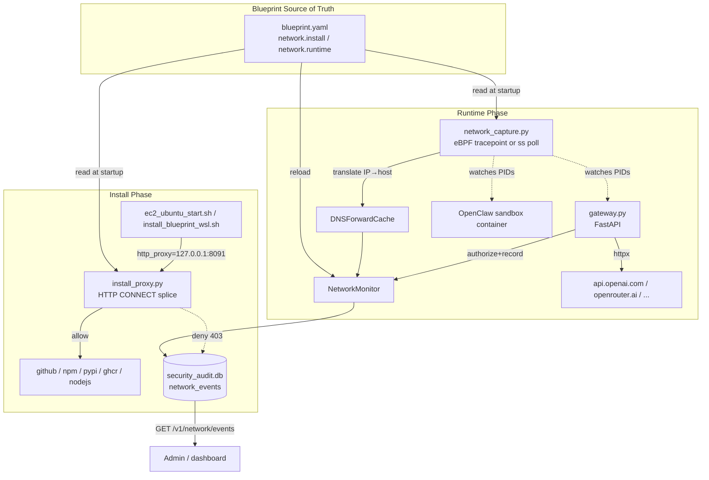
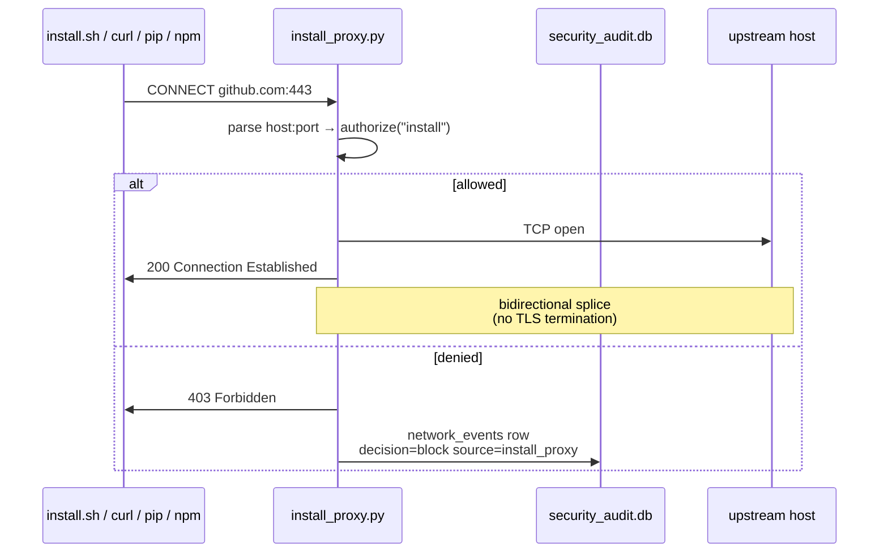
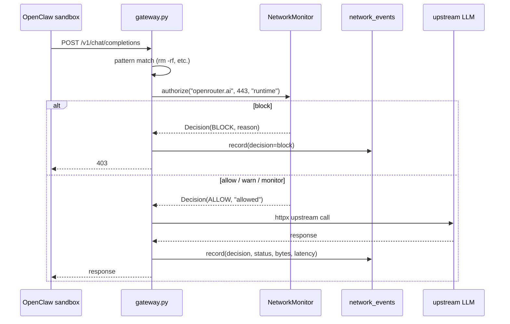
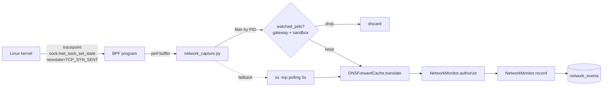
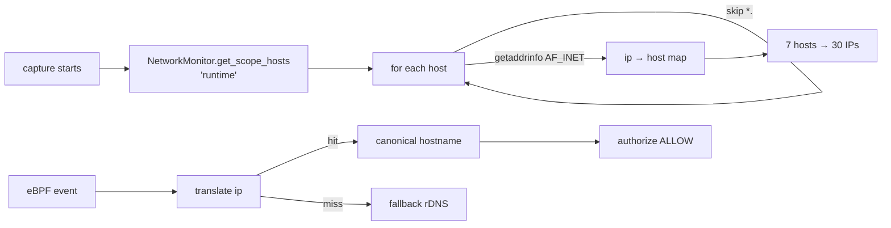
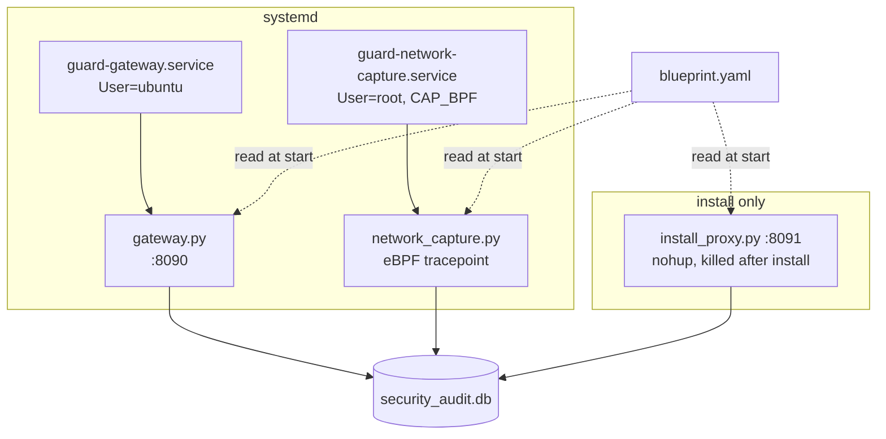

# OpenClaw Guard — Network Authorization & Detection Architecture (v6)

This document describes the network management subsystem added in worktree
`vigilant-shannon`. It plugs the two long-standing gaps in v5:

1. **Install-time blind spot** — `install_blueprint_*.sh` previously trusted any
   host that `curl` / `pip` / `npm` / `git` reached during bootstrap.
2. **Runtime invisibility** — `gateway.py` only audited *which provider/model* a
   request hit, never *which TCP endpoint* the host actually connected to, nor
   whether sandbox processes were performing out-of-band egress.

The new layer is fully **declarative** (everything lives in `blueprint.yaml`),
**non-intrusive** (no TLS termination, no CA injection, no kernel patches), and
**defense-in-depth** (three independent enforcement points share one audit DB).

---

## 1. High-level architecture



---

## 2. Blueprint schema

`nemoclaw-blueprint/blueprint.yaml` gains a top-level `network` section:

```yaml
network:
  install:
    default: deny           # deny | warn | monitor | allow
    allow:
      - host: github.com
        ports: [443]
        purpose: "NemoClaw source tarball"
      - host: registry.npmjs.org
        ports: [443]
      - host: pypi.org
        ports: [443]
      # ...20 entries covering apt / pip / npm / nvm / docker / ghcr
  runtime:
    default: warn
    allow:
      - host: api.openai.com
        ports: [443]
        enforcement: enforce
        rate_limit: { rpm: 600 }
      - host: openrouter.ai
        ports: [443]
        enforcement: enforce
        rate_limit: { rpm: 600 }
      # ...api.anthropic.com, integrate.api.nvidia.com, ...
```

### Per-entry enforcement levels

| Level     | Behavior                                                        |
|-----------|-----------------------------------------------------------------|
| `enforce` | Match → allow. Miss → if `default=deny`, return **403 + audit** |
| `warn`    | Always allow, decision recorded as `warn`                       |
| `monitor` | Always allow, decision recorded as `monitor` (silent)           |
| `allow`   | Same as `enforce` but never blocks                              |

`rate_limit.rpm` is a 60-second sliding window keyed on hostname; exceeding it
downgrades the verdict to `block`.

---

## 3. Three execution points

### 3.1 Install phase — `src/install_proxy.py`

A minimal HTTP CONNECT proxy on `127.0.0.1:8091`:



- Stdlib only (`socket` + `select`), no new deps.
- **Splice-only** — never reads TLS payload, never injects a CA.
- Bash exports `http_proxy` / `https_proxy` / `NO_PROXY=127.0.0.1,localhost,host.openshell.internal`
  before Step 3 of the installer, so `curl` / `pip` / `npm` / `git` all funnel
  through it transparently.

### 3.2 Runtime app-layer — `gateway.py` + `NetworkMonitor`



- `_forward_upstream()` and `_stream_upstream()` both call `authorize()` *before*
  hitting `httpx`, and `_emit_event()` *after* (in the streaming case, in the
  `finally` block so partial streams still produce a row).
- `/v1/network/events?limit=N` — read recent events (admin token).
- `/v1/network/policy/reload` — hot-reload `blueprint.yaml`, clears rate buckets.

### 3.3 Runtime kernel-layer — `src/network_capture.py`



- **Backend selection**:
  1. `bcc` (preferred) — kernel-side tracepoint, fires on TCP_SYN_SENT for new
     outbound connections. Stable on kernel 4.16 → 6.x (the older `tcp_v4_connect`
     kprobe broke on 6.8+ due to struct field churn).
  2. `ss -tnp` polling (fallback) — diffs ESTABLISHED snapshot every 5 s. Used
     when bcc is missing or BPF compile fails (e.g. WSL2).
- **PID filter** — only watches `gateway.py` (via `pgrep`) and the sandbox
  container's pid namespace root (via `docker inspect openclaw-sandbox`).
- Runs as **root** under `guard-network-capture.service` (eBPF needs CAP_BPF
  / CAP_SYS_ADMIN).

---

## 4. Two non-obvious bugs solved this session

### 4.1 Byte-order bug in eBPF address read

**Symptom**: eBPF rows reported `host=115.2.18.104, decision=warn`, but
`openrouter.ai` actually resolves to `104.18.2.115`. The captured IPs were the
**byte-reversed** version of the real IPs, so they never matched the whitelist.

**Root cause**: in the kernel, `args->daddr` is a `__be32` (network byte order).
BCC's `bpf_probe_read_kernel` copies the 4 bytes verbatim into a Python ctypes
`c_uint`, which on x86 is interpreted as a **little-endian** integer. Calling
`event.daddr.to_bytes(4, "big")` then re-encodes it big-endian — producing the
byte-reversed IP.

**Fix** (`network_capture.py:298`):

```python
# daddr is a __be32 (network byte order) read into a Python int by BCC on a
# little-endian host.  to_bytes(4, "little") recovers the original network-
# order bytes so inet_ntoa produces the correct IP.
ip = socket.inet_ntoa(event.daddr.to_bytes(4, "little"))
```

### 4.2 CDN IP ↔ hostname mismatch

**Symptom**: Even after the byte-order fix, eBPF would have shown the right IP
(`104.18.2.115`) but `monitor.authorize()` would still return `warn`, because
the whitelist is keyed on **hostname** (`openrouter.ai`), not IP.

Reverse DNS doesn't help: Cloudflare CDN PTR records resolve to anonymous
`*.cloudflare.com` names that don't match the whitelist either.

**Fix**: `_DNSForwardCache` (`network_capture.py:110-159`).



- Pre-resolves every non-wildcard whitelist hostname to all its A records at
  daemon startup, building an `ip → canonical_hostname` map.
- TTL = 300 s; refreshes opportunistically inside `translate()`.
- Falls back to rDNS (`_HostCache`) for IPs not in the forward map (e.g.
  unrelated background traffic).

---

## 5. Audit DB schema

A second SQLite table alongside the existing `audit_log`:

```sql
CREATE TABLE network_events (
    id          INTEGER PRIMARY KEY AUTOINCREMENT,
    timestamp   TEXT NOT NULL,         -- ISO8601 UTC
    source      TEXT NOT NULL,         -- 'install_proxy' | 'gateway' | 'ebpf' | 'ss'
    scope       TEXT NOT NULL,         -- 'install' | 'runtime'
    pid         INTEGER,
    host        TEXT,
    port        INTEGER,
    method      TEXT,
    path        TEXT,
    status      INTEGER,
    bytes_in    INTEGER,
    bytes_out   INTEGER,
    latency_ms  INTEGER,
    decision    TEXT NOT NULL,         -- 'allow' | 'warn' | 'monitor' | 'block'
    reason      TEXT
);
```

Read paths:

```bash
# Direct
sqlite3 logs/security_audit.db \
  "select datetime(timestamp,'localtime'),source,host,port,decision \
   from network_events order by id desc limit 20"

# HTTP
curl -H "Authorization: Bearer $GUARD_ADMIN_TOKEN" \
     http://127.0.0.1:8090/v1/network/events?limit=50
```

---

## 6. Process & service topology



- `guard-gateway.service` — application layer, runs as install user.
- `guard-network-capture.service` — kernel layer, runs as `root` (eBPF needs
  CAP_BPF / CAP_SYS_ADMIN). EnvironmentFile=`.env` for `BLUEPRINT_PATH`.
- `install_proxy.py` is started by the installer with `nohup`, traps EXIT to
  kill itself once Step 3 completes — it does **not** run as a long-lived
  service.

---

## 7. Verified end-to-end (EC2, kernel 6.17)

```
2026-04-08 03:23:50 | gateway | openrouter.ai | 443 | allow  | allowed
2026-04-08 03:23:39 | ebpf    | openrouter.ai | 443 | allow  | allowed   ← post-fix
2026-04-08 03:22:12 | ebpf    | 115.2.18.104  | 443 | warn   | no entry  ← pre-fix
```

- Install phase: 20 hosts allowed, all of `apt`/`pip`/`npm`/`nvm`/`docker pull`
  / `git clone` succeed; any non-listed host produces a 403 and an audit row.
- Runtime gateway: every `_forward_upstream` / `_stream_upstream` call writes
  one `network_events` row with `source=gateway`.
- Runtime kernel: eBPF tracepoint produces one row per outbound TCP SYN from
  the gateway and sandbox PIDs; CDN IPs correctly resolve to whitelist
  hostnames via `_DNSForwardCache`.

---

## 8. Deliberate non-goals

- **TLS termination / MitM** — would require a self-signed CA distributed to
  every client, breaks pinning, expands the attack surface.
- **DNS sinkhole** — handled separately if needed (CoreDNS / dnsmasq).
- **Egress quotas / billing** — out of scope; the audit DB is the integration
  point for any external metering system.
- **Webhook alert delivery** — the `network_events` table is the integration
  point; no built-in sink.

---

## 9. File map

| File                                       | Role                                              |
|--------------------------------------------|---------------------------------------------------|
| `nemoclaw-blueprint/blueprint.yaml`        | Declarative `network.install` / `network.runtime` |
| `src/network_monitor.py`                   | `NetworkMonitor` decision engine + sqlite writer  |
| `src/install_proxy.py`                     | HTTP CONNECT splice proxy on :8091                |
| `src/network_capture.py`                   | eBPF / ss daemon + DNS forward cache              |
| `src/gateway.py`                           | App-layer authorize + record on every upstream    |
| `src/onboard.py`                           | Projects runtime allow → OpenShell `network_policies` |
| `src/setup.py`                             | Wizard prompts for install/runtime defaults       |
| `ec2_ubuntu_start.sh` / `install_blueprint_wsl.sh` | Step 2b/2c/4c — daemons + systemd units   |
| `tests/test_network_monitor.py`            | 8 unit tests (decision matrix + persistence)      |
| `tests/test_install_proxy.py`              | 3 e2e tests (allow / block / audit)               |
| `tests/test_gateway.py::NetworkAuthorizationTests` | upstream-target + monitor singleton wiring |
